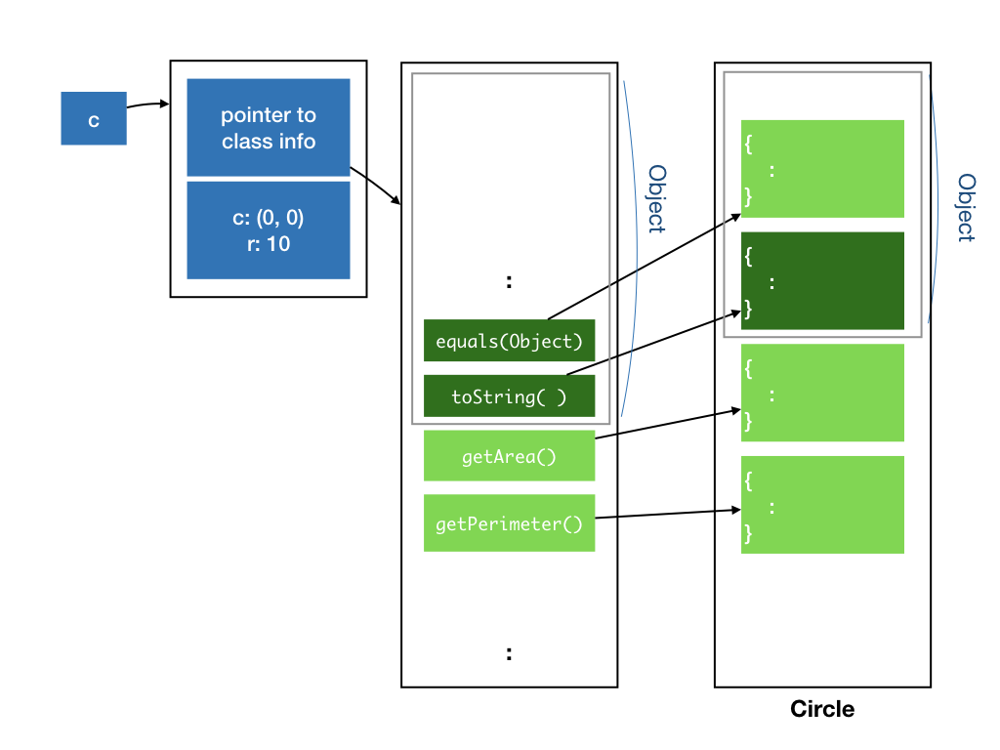
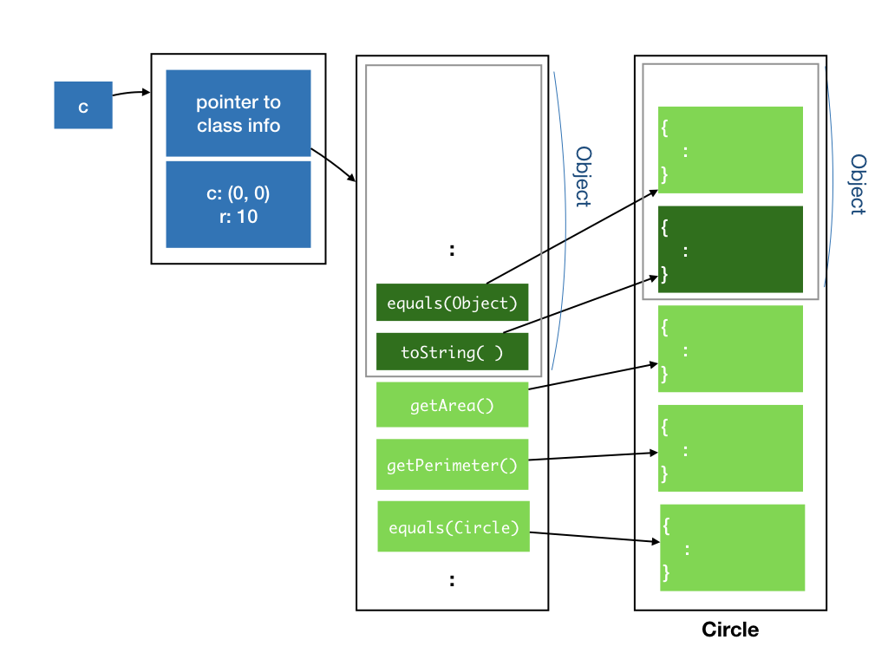

# Lecture 3

## Learning Objectives

At the end of this lecture, students should

- be familiar with the concept and power of method overriding
- understand how Java dispatches methods that have been overridden
- appreciate the usefulness of overriding `equals` and `toString` in the `Object` class
- be exposed to the `String` class and its associated methods, especially the `+` operator
- be aware that inheritance can be easily abused and leads to bad code
- understand the differences between HAS-A and IS-A relationship
- be able to use composition to model classes with HAS-A relationship
- be able to use inheritance to model classes with IS-A relationship
- understand the Liskov Substitution Principle and thus be aware that not all IS-A relationship should be modeled with inheritance
- understand the purposes of the Java keyword `final`

## Java `Object` class

In Java, every class inherits from the [class `Object`](https://docs.oracle.com/javase/9/docs/api/java/lang/Object.html) implicitly.  The `Object` class defines many useful methods that are common to all objects.  The two useful ones are :

- `equals(Object obj)`, which checks if two objects are equal to each other, and
- `toString()`, which returns a string representation of the object, and is a better way to print an object than the `print()` method and `Printable` interface we write.

The `equals()` method as implemented in `Object`, only compares if two object references refer to the same object.  In the Figure below, we show an array `circles` with three `Circle` objects.  All three circles are centered at (0, 0) with radius 10.  They are created as follows:

```Java
    Circle[] circles = new Circle[3];
    circles[0] = new Circle(new Point(0, 0), 10);
    circles[1] = new Circle(new Point(0, 0), 10);
    circles[2] = circles[1];
```

When you check `circles[0].equals(circles[1])`, however, it returns `false`, because even though `circles[0]` and `circles[1]` are semantically the same, they refer to the two different objects.  Calling `circles[1].equals(circles[2])` returns `true`, as they are referring to the same object.  


What if you need a method that compares if two circles are _semantically_ the same?  You can implement your own method, say `isTheSameCircle(Circle c)`.  But, the `equals()` method is universal (all classes inherits this method) and is used by other classes for equality tests.  So, in most cases, we can implement a method called `equals()` with the same signature with the semantic that we want[^8].

That's right.  Even though we cannot have two methods with the same signature in the same class, we can have two methods with the same signature, one in the superclass (or the superclass's superclass, and so on), one in the subclass.  The method in the subclass will override the method in the superclass.  For example,


```Java
class Circle implements Shape, Printable {
    :
  @Override
  public boolean equals(Object obj) {
    if (this == obj) {
      return true;
    }
    if (obj instanceof Circle) {
      Circle circle = (Circle) obj;
      return (circle.center.equals(center) && circle.radius == radius);
    } else
      return false;
  }
}
```

Line 7 above compares if the two center points are equal, and the two radius values are equal.  So, we compare if the two circles are semantically the same.  The rest of this code requires some explanation:

- Line 3 uses the same `@Override` annotation that we have seen before -- we are telling the compilers that we are overriding a method in the superclass.
- Line 4 declares the method `equals`, and note that it has to have exactly the same signature as the `equals()` method we are overriding.  Even though we meant to compare two `Circle` objects, we cannot declare it as `public boolean equals(Circle circle)`, since the signature is different and the compiler would complain.
- Since `obj` is of an `Object` type, we can actually pass in any object to compare with a `Circle`.  Line 5 checks if the comparison makes sense, by checking if `obj` is instantiated from a `Circle` class, using the `instanceof` keyword.  If `obj` is not even a `Circle` object, then we simply return `false`.
- If `obj` is an instance of `Circle`, we assign `obj` to a variable of type `Circle` and compare as in Line 7.

For the code above to work, we have to override the `equals` method of `Point` as well.  That is left as an exercise[^1].

One final note: polymorphism works here as well.  If we have an object reference `obj` of type `Object` that refers to an instance of a `Circle`, calling `obj.equals()` will invoke the `equals()` method of `Circle`, not `Object`, just like the case of interfaces.

[^1]: If you override `equals()` you should generally override `hashCode()` as well, but let's leave that for another lesson on another day.

Recall that when a class implements an interface, an instance of that class can take on the type of that interface.  Similarly, when a class inherits from a parent class, an instance of that class can take on the type of the parent class.  So, we can do the following:

```Java
Circle c = new Circle(new Point(0,0), 10);
Object o = c;
```

Line 2 assigns the circle object `c` to `o` of type `Object`.  So, both `o` and `c` are referring to the same objects.  Due to type checking at compile time, however, Java does not allow methods and fields in the subclass (e.g., `Circle`) that is not in the superclass (e.g., `Object`) to be called.  In this example, only the methods known to `Object` can be accessed by `o`.

Now, consider what would happen if we override the method `equals()` from the `Object` class.  

The method table will update the entry for `equals()` to point to the implementation provided by the `Circle` class, instead of the `Object` class.



Now, consider what would happen if we _overload_ the method `equals()` with one that takes in a `Circle` object.  I also throw in a couple of `System.out.print()` to help us figure out what is going on.

```Java
class Circle implements Shape, Printable {
    :
  @Override
  public boolean equals(Object obj) {
    System.out.print("equals(Object) called\n");
    if (obj == this) {
      return true;
    }
    if (obj instanceof Circle) {
      Circle circle = (Circle) obj;
      return ((circle.center.equals(center) && circle.radius == radius);
    } else
      return false;
    }

    public boolean equals(Circle circle) {
      System.out.print("equals(Circle) called\n");
      return ((circle.center.equals(center) && circle.radius == radius);
    } 
  }
```

Since this new `equals()` method does not override the method in `Object`, it gets its own slot in the method table of `Circle`, instead of reusing one from the `Object`.



Now, consider which version of `equals` are called by the following:

```Java
Circle c1 = new Circle(new Point(0,0), 10);
Circle c2 = new Circle(new Point(0,0), 10);
Object o1 = c1;
Object o2 = c2;

o1.equals(o2);
o1.equals((Circle)o2);
o1.equals(c2);
c1.equals(o2);
c1.equals((Circle)o2);
c1.equals(c2);
```

Lines 6-9 call `equals(Object)` defined in `Circle`， while Lines 10-11 call `equals(Circle)` defined in `Circle`.  Let's look at why for each one:

- Line 6 calls `equals` of an `Object` object on an `Object` object.  Java checks through all methods defined in `Object`, and finds a method that matches the signature, which is the `equals(Object)` (which `Circle` has overridden). This is the one that will get called.
- Line 7-8 call `equals` of an `Object` object on a `Circle` object.  Java checks through all methods defined in `Object` and finds one method that matches the signature, which is `equals(Object)` (which `Circle` has overridden).  Even though there is another method `equals(Circle)` defined, it is defined as part of the `Circle` class, which Java refuses to access because `o1` is declared to have the type `Object`.  Since the only method that Java can find has an argument of type `Object`, the argument is cast as an `Object` when `equals` is invoked.
- Line 9 calls `equals` of a `Circle` object on an `Object` object.  Java finds a method with the matching signature, `equals(Object)`, and invokes that.
- Finally, Lines 10-11 call `equals` of a `Circle` object on a `Circle` object.  Java finds a method with the matching signature, `equals(Circle)`, and invokes that.

Why do we need to override `equals` in `Object`, rather than just using the `Circle`-specific `equals(Circle)`?  As shown above, only when an object declared as `Circle` calls `equals` on another `Circle` object, the `Circle`-specific `equals(Circle)` is invoked.  
To write code that is general and reusable, we should exploit OO polymorphism, that means different subclasses of `Object` implement their own customized version of `equals`, and the right version of `equals` will be called.

One example of where this is called the `contains(Object)` method from class `ArrayList` (we will cover this later in class), which checks if an object is already in the list, and to check this, it checks for equality of the given object with every object in the `ArrayList`, by calling `equals(Object)`.

## toString

We now turn our attention to another method in `Object` that we could override, the `toString()` method.  `toString()` is called whenever the `String` representation of an object is needed.  For instance, when we try to print an object.   By default, the `toString` of `Object` simply prints the name of the class, followed by `@`, followed by the reference.   It is often useful to override this to include the content of the object as well, for debugging and logging purposes.  This is a much more useful and flexible way than writing our own `print()` method as we have seen in earlier lectures, since we are not limited to printing to standard output anymore.

!!! note "java.lang.String"
    `String` is one of the many useful classes provided by Java.  You can skim through to see what methods are available and keep the [API reference](https://docs.oracle.com/javase/8/docs/api/java/lang/String.html) handy.

```Java
class Point {
  :
  public String toString() {
    return "(" + x + "," + y ")";
  }
}
```

Now, if we run:
```Java
Point p = new Point(0,0);
System.out.println(p);
```

It should print `(0,0)` instead of `Point@1235de`.

The ability to override methods that you inherit from a parent, including root class `Object`, makes overriding an extremely powerful tool.  It allows you to change how existing libraries behave, and customize them to your classes, without changing a single line of their code or even accessing their code!

As Uncle Ben said, "With great power, comes great responsibility."  We must use overriding and inheritance carefully.  Since we can affect how existing libraries behave, we can easily break existing code and introduce bugs.  Since you may not have access to these existing code, it is often tricky to trace and debug.  

!!! note "Using `super` To Access Overridden Methods"
    After a subclass overrides a method in the superclass, the methods have been overridden can still be called, with `super` keyword. 
    For instance, the following `toString` implementation of `Point` calls the `toString` from `Object`, to prefix the string representation of Point with the class and reference address.
    ```Java
    @Override
    public String toString() {
      return super.toString() + " (" + x + "," + y + ")";
    }
    ```

## The `protected` and Default Access Modifiers

In the last lecture, when we inherit `Circle` from `PaintedShape`, we set the fields `fillColor` etc to `private`, to create an abstraction barrier between the superclass and its subclasses.  This barrier allows the implementor of the superclass to freely change the internal representation of the superclass without worrying about the effect on the subclasses.

Sometimes, the implementor of a superclass may choose to allow the subclasses to have access to some of its fields and methods, but yet prevent other classes from accessing them.  This type of access restriction can be achieved with the `protected` access modifier. 

!!! note "`protected` in Other Languages"
    C++ and C# both provide `protected` keyword, allowing subclasses to access `protected` fields and methods of the superclass.  Swift, however, decided that [deciding fields/methods access based on inheritance complicates things without bringing any advantage](https://developer.apple.com/swift/blog/?id=11) and does not provide the `protected` access modifier.

### Java Packages

So far we have written several classes and interfaces (`Circle`, `Point`, `Shape`, `Printable`, `PaintedShape`, `Square`, etc).  We are using common names to name our classes and interfaces, and it is not inconceivable that in a large software project using external libraries that we will end up with multiple classes with the same name!  For instance, Java library provides a [`Point`](https://docs.oracle.com/javase/9/docs/api/java/awt/Point.html) class and a [`Shape`](https://docs.oracle.com/javase/7/docs/api/java/awt/Shape.html) interface as well.  

Java `package` mechanism allows us to group relevant classes and interfaces together under a _namespace_.  You have seen two packages so far: `java.awt` where we import the `Color` class from, and `java.lang` where we import the `Math` class from.  These are provided by Java as standard libraries.  We can also create our own package and put the classes and interfaces into the same package.  We (and the clients) can then import and use the classes and interfaces that we provide.  

Besides providing namespace to disambiguate classes or interfaces with the same name, Java `package` also provides another higher-layer of abstraction barrier.  In Java, a `protected` field or method can be accessed by other classes in the same package.

Finally, Java has the forth access modifier known as the default modifier.  This access modifier (or lack of it) is used when we do not specify `public`, `protected`, nor `private`.  A field or member with no access modifier is private to the package -- it is `public` to all classes within the same package, but `private` to classes outside of the package.  The default access modifier is also known as _package-private_ by some.

The following table, taken from [Oracle's Java Tutorial](https://docs.oracle.com/javase/tutorial/java/javaOO/accesscontrol.html)
summarizes the access modifiers:

| Access Modifier  | Class  | Package  | Subclass  | World |
| ----- | ---- | ---- | ---- | ---- |
| public | Y | Y | Y |  Y |
| protected | Y | Y | Y | N |
| no modifier | Y | Y | N | N |
| private | Y |  N | N | N | 

In Java, every class belongs to a package, whether we like it or not.  If we do not declare that a class belongs to a package, then it belongs to the default package.

We will not be discussing `package` much more than what we have done today.  You can learn more about packages via [Oracle's Java Tutorial](https://docs.oracle.com/javase/tutorial/java/package/index.html).


## Modeling HAS-A Relationship

Inheritance in OO tends to get overused.  _In practice, we seldom use inheritance_.  Let's look at some examples of how _not_ to use inheritance, and why.

You may come across examples online or in books that look like the following:

```Java
class Point {
  protected double x;
  protected double y;
    :
}

class Circle extends Point {
  protected double radius;
    :
}

class Cylinder extends Circle {
  protected double height;
    :
}
```

`Circle` implemented like the above would have the center coordinate inherited from the parent (so it has three fields, x, y, and radius), and `Cylinder` would have the fields corresponding to a circle, which is its base, and the height.  So, we are _reusing_ the fields and the code related to initializing and manipulating the fields.

When we start to consider methods encapsulated with each object, things start to get less intuitive.  What does `getPerimeter()` and `getArea()` of `Cylinder` means?  How about `distanceTo` between a `Cylinder` and a `Point`?   What is the meaning of a `Circle` containing a `Cylinder`?

The inheritance hierarchy above actually models the HAS-A relationship: A circle has a center (which is a point), a cylinder has a base which is a circle.  Therefore, a better way to capture the relationship between the three types of objects is through _composition_:

```Java
class Point {
  double x;
  double y;
    :
}

class Circle {
  Point center;
  double radius;
    :
}

class Cylinder {
  Circle base;
  double height;
    :
}
```

Composition allows us to build more complex classes from simpler ones, and is usually favored over inheritance.  

The `PaintedShape` class from Lecture 2, for instance, could be modeled as a composition of a `Style` object and `Shape` object.

```Java
class Style {
  Color fillColor;
  Color borderColor;
    :
}

class PaintedShape {
  Style style;
  Shape shape;
    :
  public double getArea() {
    return shape.getArea();
  }
  :
  public void fillWith(Color c) {
    style.fillWith(c);
  }
    :
}
```

The design above is also known as the _forwarding_ -- calls to methods on `PaintedShape` gets forwarded to either `Style` or `Shape` objects.

## Modeling IS-A Relationship

A better situation to use inheritance is to model a IS-A relationship: when the subclass behaves just like parent class, but has some additional behaviors.  For instance, it is natural to model a `PaintedCircle` as a subclass of `Circle` -- since a PaintedCircle has all the behavior of `Circle`, but has _additional_ behaviors related to being painted.

```Java
class PaintedCircle extends Circle {
  Style style;
    :
}
```

A more tricky situation for modeling a IS-A relationship occurs when the subclass behaves just like the parent class _most_ of the time, but sometimes behave slightly differently than the parent.  Consider how we model a rectangle and a square.  Normally, we consider a square IS-A special case of a rectangle.  So, we could model as:

```Java
class Rectangle {
  double width, height;
  Point topLeft;
  Rectangle(Point topLeft, in width, int height) {
    this.topLeft = topLeft;
    this.width = width;
    this.height = height;
  }
}

class Square extends Rectangle {
  Square(Point topLeft, int width) {
      super(topLeft, width, width);
  }
}
```

So far, so good.

Now, suppose the two classes are written by two different developers.  The developer who wrote Rectangle decided to add the method `resizeTo`:

```Java
class Rectangle {
      :
    void setSize(int width, int height) {
        this.width = width;
        this.height = height;
    }
}
```

This developer assumes the behavior that, after calling `setSize(w, h)`, the width of the rectangle will be `w` and the height will be `h`.  He/she publishes this API, and another developer then assumes this behavior, and wrote some code, like:

```Java
void doSomething(Rectangle r) {
  r.setSize(1, 2);
    :
}
```
What should the developer who develops `Square` do?  Since `Square` is a subclass of `Rectangle`, it would inherit `setSize` from its parent, but it does not make sense to call `setSize` with two different parameters.  Sure, `Square` can overload `setSize` and provide a `setSize` with one parameter only, but that does not prevent someone from calling `setSize` with two parameters on a `Square`.  Someone could do the following and the code would still compile and run, turning the square into a rectangle!

```Java
Square s = new Square(new Point(0,0), 10);
s.setSize(4, 8);
```

The `Square` developer can try to override `setSize`, to ignore the second parameter:

```Java
class Square {
    :
  void setSize(int width, int height) {
    this.width = width;
    this.height = width;
  }
}
```

This makes more sense and would make everyone who uses `Square` happy -- a square is always a square -- but it introduces an _inconsistency_ in behavior and will most likely break another part of the code that the developer is totally unaware of.  The developer of `doSomething` suddenly cannot assume that `setSize` works as intended and documented.

It is a developer's responsibility that any inheritance with method overriding does not alter the behavior of existing code.  This brings us to the _Liskov Substitution Principle_ (LSP), which says that: "Let $\phi(x)$ be a property provable about objects $x$ of type $T$. Then $\phi(y)$ should be true for objects $y$ of type $S$ where $S$ is a subtype of $T$."   

This means that if $S$ is a subclass of $T$, then an object of type $T$ can be replaced by an object of type $S$ without changing the desirable property of the program.

In the example above, this means that everywhere we can expect rectangles to be used, we can replace a rectangle with a square.  This was no longer true with the introduction of `setSize` method.

## Preventing Inheritance and Method Overriding

Sometimes, it is useful for a developer to explicitly prevent a class to be inherited.  Not allowing inheritance would make it much easier to argue for the correctness of programs, something that is important when it comes to writing secure programs.  Both the two java classes you have seen, `java.lang.Math` and `java.lang.String`, cannot be inherited from.  In Java, we use the keyword `final` when declaring a class to tell Java that we ban this class from being inherited.

```Java
final class Circle {
    :
}
```

Alternatively, we can allow inheritance, but still prevent a specific method from being overridden, by declaring a method as `final`.  Usually, we do this on methods that are critical for the correctness of the class.

```Java
class Circle {
   :
  final public boolean contains(Point p) {
    :
  }
}
```

!!! note "final variable"
    The keyword `final` has another use.   When declaring a variable as `final`, just like
        `PI` in `Math`, it prevents the variable from being modified.  In other words, the variable becomes constant.
    ```Java
        public static final double PI   = 3.141592653589793;
    ```


## Exercise

1. In the class `Point`, add a new method `equals` that overrides the `equals` from `Object`, so that when calling `p.equals(q)` on two `Point` objects, the method return `true` if and only `p` and `q` coincide (i.e., have the same coordinates).

2. Consider the following classes: `FormattedText` adds formatting information to the text. We call `toggleUnderline()` to add or remove underlines from the text. A `URL` _is a_ `FormattedText` that is always underlined.

    ```Java
    class FormattedText {
      public String text; 
      public boolean isUnderlined;
      public void toggleUnderline() { 
        isUnderlined = (!isUnderlined);
      }
    }

    class URL extends FormattedText { 
      public URL() { 
        isUnderlined = true;
      }
      public void toggleUnderline() { 
        // do nothing
      }
    }
    ```

    Does it violate the Liskov Substitution Principle? Explain.

3.  Consider each of the code snippets below.  Will it result in a compilation or run time error?  If not, what will be printed? 

    (a)
    ```Java
    class A {
      void f() { 
        System.out.println("A f"); 
      }
    }

    class B extends A {
    }

    B b = new B();
    b.f();
    A a = b;
    a.f();
    ```

    (b)
    ```Java
    class A {
      void f() {
        System.out.println("A f");
      }
    }

    class B extends A {
      void f() {
        System.out.println("B f");
      }
    }

    B b = new B();
    b.f();
    A a = b;
    a.f();
    a = new A();
    a.f();
    ```

    (C)
    ```Java
    class A {
      void f() {
        System.out.println("A f");
      }
    }

    class B extends A {
      void f() {
        super.f();
        System.out.println("B f");
      }
    }

    B b = new B();
    b.f();
    A a = b;
    a.f();
    ```

    (d)
    ```Java
    class A {
      void f() {
        System.out.println("A f");
      }
    }

    class B extends A {
      void f() {
        this.f();
        System.out.println("B f");
      }
    }

    B b = new B();
    b.f();
    A a = b;
    a.f();
    ```

    (e)
    ```Java
    class A {
      void f() {
        System.out.println("A f");
      }
    }

    class B extends A {
      int f() {
        System.out.println("B f");
        return 0;
      }
    }

    B b = new B();
    b.f();
    A a = b;
    a.f();
    ```

    (f)
    ```Java
    class A {
      void f() {
        System.out.println("A f");
      }
    }

    class B extends A {
      void f(int x) {
        System.out.println("B f");
        return x;
      }
    }

    B b = new B();
    b.f();
    b.f(0);
    A a = b;
    a.f();
    a.f(0);
    ```

    (g)
	```Java
    class A {
      public void f() {
        System.out.println("A f");
      }
    }

    class B extends A {
      public void f() {
        System.out.println("B f");
      }
    }

	B b = new B();
	A a = b;
	a.f();
	b.f();
	```

    (h)
	```Java
    class A {
      private void f() {
        System.out.println("A f");
      }
    }

    class B extends A {
      public void f() {
        System.out.println("B f");
      }
    }

	B b = new B();
	A a = b;
	a.f();
	b.f();
	```

    (i)
	```Java
    class A {
      static void f() {
        System.out.println("A f");
      }
    }

    class B extends A {
      public void f() {
        System.out.println("B f");
      }
    }

	B b = new B();
	A a = b;
	a.f();
	b.f();
	```

    (j)
	```Java
    class A {
      static void f() {
        System.out.println("A f");
      }
    }

    class B extends A {
      static void f() {
        System.out.println("B f");
      }
    }

	B b = new B();
	A a = b;
	A.f();
	B.f();
	a.f();
	b.f();
	```

    (k)
    ```Java
	class A {
	  private int x = 0;
	}

	class B extends A {
	  public void f() {
		System.out.println(x);
	  }
	}

	B b = new B();
	b.f();
	```

    (l)
    ```Java
	class A {
	  private int x = 0;
	}

	class B extends A {
	  public void f() {
		System.out.println(super.x);
	  }
	}

	B b = new B();
	b.f();
	```

    (m)
    ```Java
	class A {
	  protected int x = 0;
	}

	class B extends A {
	  public void f() {
		System.out.println(x);
	  }
	}

	B b = new B();
	b.f();
	```

    (n)
    ```Java
	class A {
	  protected int x = 0;
	}

	class B extends A {
	  public int x = 1;
	  public void f() {
		System.out.println(x);
	  }
	}

	B b = new B();
	b.f();
	```

    (o)
    ```Java
	class A {
	  protected int x = 0;
	}

	class B extends A {
	  public int x = 1;
	  public void f() {
		System.out.println(super.x);
	  }
	}

	B b = new B();
	b.f();
	```

4.  Consider each of the code snippets below.  Which will result in a compilation error?

    (a)
	```Java
    class A {
	  public void f(int x) {}
	  public void f(boolean y) {}
	}
	```

    (b)
	```Java
    class A {
	  public void f(int x) {}
	  public void f(int y) {}
	}
	```

    (C)
	```Java
    class A {
	  private void f(int x) {}
	  public void f(int y) {}
	}
	```

    (d)
	```Java
    class A {
	  public int f(int x) {
		  return x;
	  }
	  public void f(int y) {}
	}
	```

    (e)
	```Java
    class A {
	  public void f(int x, String s) {}
	  public void f(String s, int y) {}
	}
	```

