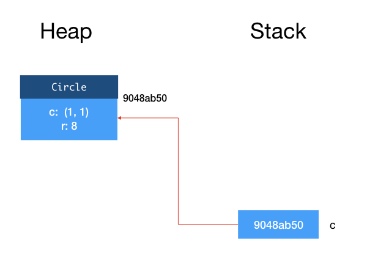
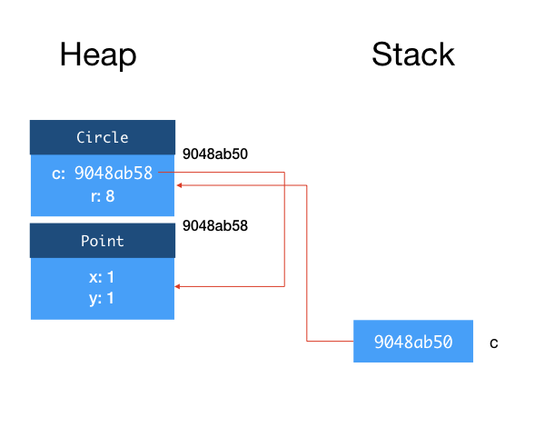
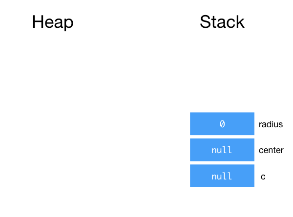
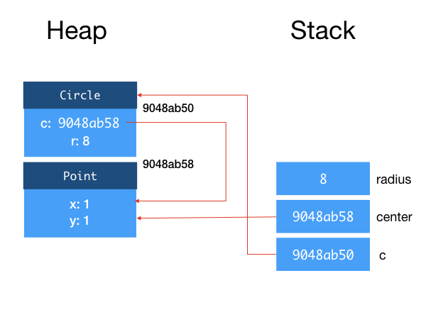
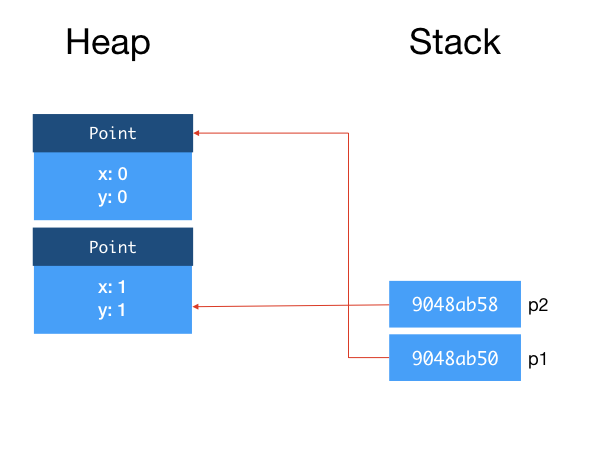
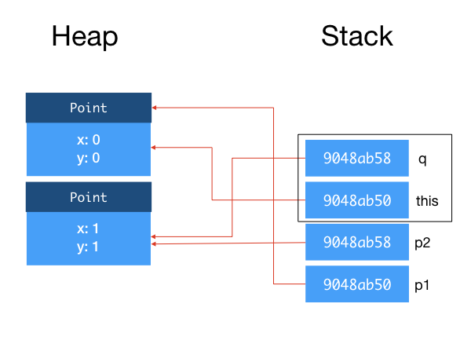
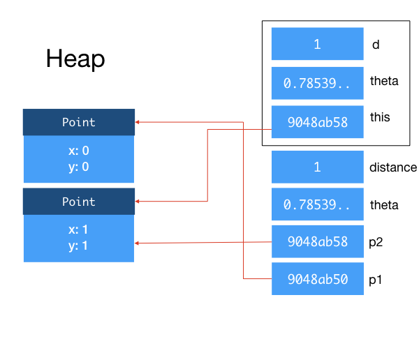

# Lecture 4: Types, Memory, Exception 

## Learning Outcomes
After this class, students should:

- understand when memory are allocated/deallocated from the heap vs. from the stack
- understand the concept of call stack in JVM
- understand how Java call by reference and call by value
- know about the keywords `null`, `try`, `catch`, `finally`, `throw`, and `throws`.
- appreciate why exceptions is a useful way of handling errors
- aware of the differences between errors, unchecked exception, and checked exception in Java
- be able to trace through the control flow of `try`/`catch`/`finally` block
- how to generate an exception and create a new exception
- not commit bad practices when using exceptions

## `java` and `javac`

Now that we have gone through the basic concepts of OO programming, let's take a step away from OO for the moment and look at some other important features of Java.

In your [Lab 0](lab00.md), we showed you how to use `javac` to compile your Java program and `java` to execute your program.  

`javac` is a _compiler_. It reads in Java source files as a string, parses the string for syntax errors, and converts the Java code into an intermediate binary format called the _bytecode_.  Bytecode is an instruction set akin to hardware instructions but is typically executed by a software interpreter.

This behavior is different from what `gcc` does for C programs.  `gcc` produces native machine code, corresponding to hardware instructions.  As such, a C program your `gcc` produced on your home machine will not run on `sunfire`.  

Java designers (led by James Gosling) wanted a language that can be compiled into a form that is platform and hardware independent, thus, they developed their own runtime environment called the Java Virtual Machine (JVM), which interprets and executes the bytecode, optimizes the execution, and manages the memory of Java programs.  Bytecode produced (the `.class` files) on one platform can run other platforms.

!!! note "Other Bytecode Languages"
    Many other programming environments offer compilation to bytecode.  Python, for instance, compiles Python code into `.pyc` files, which contain Python bytecode.  Facebook's HHVM compiles PHP into bytecode.  Google's V8 compiles Javascript into bytecode too.
  
!!! note "Other JVM Languages"
    While JVM was initially designed for Java, its popularity has led to the development of other languages that compile to JVM bytecode and run on JVM, such as Clojure, Groovy, Scala and Kotlin.  

!!! note "Other Java Compilers"
    While we stick to the Java 9 compiler from Oracle for CS2030, there are other Java compilers: `ecj` is the Java compiler from Eclipse -- if you use Eclipse IDE, this is the default compiler.  `gcj` is the GNU Java Compiler (which has been removed from GCC 7 onwards).

Once you produce the `.class` files containing the bytecode corresponding to the code you have written, you can pass the bytecode to JVM for execution by invoking the `java` command.  This is when your code gets executed -- objects get created and stored in memory, methods get called, etc. 

### Compile Time vs Run Time
It is important to understand the difference between the two stages, compile time (when we invoke `javac`) and run time (when we invoke `java`).

During compile time, the compiler does not always know what value a variable will take, nor will it know the sequence of execution of the programs.  As such, the compiler opts to be conservative and only makes the decision on what it knows for sure.  We have encountered this before -- recall our discussion on late binding:
```Java
  for (Printable o: objs) {
      o.print();
  }
```

The compiler cannot always be sure what is the class of the object the variable `o` will refer to during runtime, and thus, it cannot be sure which version of `print` method will be executed.  

In another example, we have

```Java
  Circle c = new Circle(new Point(0,0), 10);
  Printable c2 = c;
  c2.getArea();
```

At compile time, `c2` has a type `Printable`, and we try to invoke `getArea` which is a method available in `Circle`, not `Printable`.  Even though if we trace through the three lines of code above, we (the humans) can be sure that `c2` is pointing to a `Circle` object and it is fine to call `getArea`, the compiler has to be conservative as it is designed to work on arbitrarily complex programs with an unknown sequence of execution.  The compiler thus does not allow us to call `c2.getArea()`.

### `jshell`

If we compile a program with `javac` and then execute it with `java`, we have two distinct phases.  An error reported by `javac` occurs during compilation and is a _compile time error_.  An error reported by `java` occors during run time, and is a _run time error_.  

If we "play" with our classes and with Java syntax using `jshell`, however, the differences between compile time and run time error are blurred.  `jshell` is an "REPL" tool, which stands for "read-eval-print loop", and it does exactly what the name says: it repeatedly reads in a Java statement, evaluates the statement, and prints out the result.  The reading step is analogous to compiling, while the evaluating and printing steps are analogous to running a program.  So, `jshell` produces an error message, it could be due to an error triggered by either compile time or run time.

## 1. Types

The above discussion brings us back to the topic of types.  Unlike C which is not type safe or  Python and Javascript which are weakly typed, Java belongs to a class of programming language which is statically typed and enforces type safety through a rich set of rules.  Understanding these rules and appreciating them is important to writing good and general Java programs, as well as picking up other statically and strongly typed programming languages.

### Type Conversion

Sometimes a programmer knows better than the compiler the intention of the program.  In this case, it is useful for a programmer to override the compiler's decision.  One possible such override is to force the type of a variable to be something more appropriate, through _type casting_.

We have seen type casting in action when we discussed about type safety (see [Lecture 1](lec01.md)).  Recall that, in C, we can type cast two seemingly incompatible types to each other.  We have also seen it [last week](lec03.md) when we cast an `Object` variable to a `Circle` when we discuss overriding of the `equals()` method.

Type casting is a form of type conversion, in particular, an _explicit type conversion_. 

Let's talk about _implicit type conversion_ first.  Implicit conversion can happen in several contexts:

- Assignment, for instance, assigning a variable of type `Circle` to a variable of type `Shape.
- Method invocation, for instance, when you pass a variable of type `Circle` to a method expecting `Shape`.
- String conversion, when one of the operands of `+` is a `String` and the other is not, in which case it will be converted to `String` (by calling `toString()`).

Suppose we have a reference type $S$ and $T$ is a subtype of $S$ (denoted $T <: S$), then converting $T$ to $S$ is checked at compile time.  This conversion is known as _widening reference conversion_.

The converse is not true.  If we want to convert $S$ to $T$ (known as _narrowing reference conversion_), then we need explicit casting.  Such conversion is checked at run time, and it may cause an exception.  

```Java
class S { }
class T extends S { }
class U extends S { } 

S s1, s2;
T t = new T();
U u = new U();

s1 = t;  // always OK since this is a widening reference conversion.
s2 = u;  // always OK since this is a widening reference conversion.
t  = s1; // not allowed since it is a narrowing reference conversion.
t  = (T)s1; // explicit conversion allowed by compiler, no problem during run time.
t  = (T)s2; // explicit conversion allowed by compiler, but cause run time error.
```

!!! note "Java subtyping and conversion specification"
    We are not going through all the gory details of Java subtyping and type conversion rules.  Chapter 5 of [Java Language Specification](https://docs.oracle.com/javase/specs/jls/se7/html/jls-5.html) succinctly and precisely defines all the rules on this topic.  For those students who are interested, you can check it out.  Otherwise, we will discover some of the other rules along the way as we learn more about Java in practice.

### Subtyping

We have seen how subtyping works in Java: we say that if a class $T$ extends from class $S$ or implements interface $S$, $T$ is a subtype of $S$.  The notion of subtyping, however, is more general than that.  In the study of programming languages, we say that $T$ is a subtype of $S$ if a piece of code written for variables of type $S$ can also safely be used on variables of type $T$.   In the context of Java and other OO languages, inheritance and implementation of interfaces satisfy these conditions.  In other languages, however, we can create subtypes without these OO notions.  In Ada, for instance, we can create a subtype by restricting the range of values of a type.  E.g., we can create a subtype `digit` from the type `int`, restricting its value to ranging between 0 and 9.

With this more general notion of subtyping, we can define subtype relations between the primitive types, as follows:

`byte` $<:$ `short` $<:$ `int` $<:$ `long` $<:$ `float` $<:$ `double`; and `char` $<:$ `int`

We can also extend the notion of widening conversion and narrowing conversion to primitive types.

### Variance of Types

Given a type $T$, we can create other complex types that depend on $T$.  For instance, we can have an array of type $T$, a generic class parameterized by $T$ (next lecture), a method that takes in $T$ and returns $T$, etc.

The term _variance of types_ refers to how these more complex types relate to each other, given the relationship between the simpler types.

Suppose $A(T)$ is the complex type constructed from $T$.  Then we say that 

- $A$ is _covariant_ if $T <: S$ implies $A(T) <: A(S)$, 
- $A$ is _contravariant_ if $T <: S$ implies $A(S) <: A(T)$,
- $A$ is _bivariant_ if it is both covariant and contravariant, and
- $A$ is _invariant_ if it is neither covariant nor contravariant.

For example, in Java, arrays (of reference type) are covariant.  This means that, `T[]` is a subtype of `S[]`, if `T` is a subtype of `S`.  Based on the type conversion rule, it is OK to assign any array of reference type to an array of `Object` objects, or pass an array of reference type to a method that expects an array of `Object` objects.  This decision (of making Java arrays covariant) makes it possible to write very generic method that operates on array, as provided by the Java utility class [`Arrays`](https://docs.oracle.com/javase/9/docs/api/java/util/Arrays.html).[^1]

We will see examples of complex type $A$ that is invariant and contravariant later in this module.

[^1]: A utility class is a Java class that contains only class methods and class fields.  You have seen another example in CS2030, `Math`, and will see a few more in this module.

## 2. Heap and Stack

As mentioned earlier, JVM manages memory of Java programs while its bytecode instructions are interpreted and executed.  Different JVM implementation may implement these differently, but typically a JVM implementation partitions the memory into several regions, including
- _method area_ for storing the code for the methods;
- _metaspace_ for storing meta information about classes;
- _heap_ for storing dynamically allocated objects;
- _stack_ for local variables and call frames.

Since the concepts of heap and stack are common to all execution environments (either based on bytecode or machine code), we will focus on them here.

The _heap_ is the region in memory where all objects are allocated in and stored, while the _stack_ is the region where all variables (including primitive types and object references) are allocated in and stored.

Considers the following two lines of code.
```Java
Circle c;
c = new Circle(new Point(1, 1), 8);
```
Line 1 declares a variable `c`.  When Java executes this line of code, it allocates some memory space for an object reference for `c`, the content is initialized to `null`.  Since `c` is a variable, it resides in the stack.

!!! note "`null` in Java"
    `null` is a special value for the object reference, that signifies that this reference is not pointing to any object.  This is similar to the `null` in Javascript, `NULL` macro in C, `nullptr` in C++11, `None` in Python, `nil` in Objective-C.  (Again, you see here computer scientists just can't agree on names!)  [Sir Tony Hoare](https://en.wikipedia.org/wiki/Tony_Hoare) (who also invented quicksort) famously apologized for inventing the null pointer.  He calls it his billion-dollar mistake.

Line 2 creates a new Circle object.  When Java executes this line of code, it allocates some memory space for a `Circle` object on the heap.  The memory address of this memory space becomes the reference of the object and is assigned to the variable `c`.

This is shown in the figure below[^2].



[^2]: Unlike earlier figures, I didn't show the class metadata and method tables for simplicity.

The first argument to `Circle` constructor is also an object, so to be more precise, when Line 2 above is executed, a `Point` object is also created and allocated on the heap.  So the field `c` inside `Circle` is actually a reference to this object.



Now, let's look at a slightly different example.  
```Java
Circle c;
Point center;
double radius;
radius = 8;
center = new Point(1, 1);
c = new Circle(center, radius);
```

In the second example, we have three variables, `c`, `center`, and `radius` .  Lines 1-3 declare the variables, and as a result, we have three variables allocated on the stack.  Recall that for object references, they are initialized to `null`.  Primitive type variables (e.g., `radius`) are initialized to 0.



After Lines 4-6, we have:



### Call Stack

Now, let's look at what happens when we invoke a method.  Take the `distanceTo` method in `Point` as an example:

```Java
class Point {
  private double x;
  private double y;
  public double distanceTo(Point q) {
    return Math.sqrt((q.x - this.x)*(q.x - this.x)+(q.y - this.y)*(q.y - this.y));
  }
}
```
and the invocation:
```Java
Point p1 = new Point(0,0);
Point p2 = new Point(1,1);
p1.distanceTo(p2);
```

After declaring `p1` and `p2` and creating both objects, we have:


When `distanceTo` is called, JVM creates a _stack frame_ for this instance method call.  This stack frame is a region of memory that tentatively contains (i) the `this` reference, (ii) the method arguments, and (iii) local variables within the method, among other things[^3][^4].  When a class method is called, the stack frame does not contain the `this` reference.

[^3]: This is not that difference from how an OS handles function call in a machine code, as you will see in CS2100/CS2106.
[^4]: The other things are JVM implementation independent and not relevant to our discussion here.



You can see that the _references_ to the objects `p1` and `p2` are copied onto the stack frame. `p1` and `this` point to the same object, and `p2` and `q` point to the same object.
Within the method, any modification done to `this` would change the object referenced to by `p1`, and any change made to `q` would change the object referenced to by `p2` as well.
After the method returns, the stack frame for that method is destroyed.

Let's call the `move` function from your [Lab 0](lab00.md), with arguments `(double theta, double d)`.

```Java
double theta = Math.PI/4.0;
double distance = 1;
p2.move(theta, distance);
```

Again, we create a stack frame, copy the reference to object `p2` into `this`, copy `theta` from the calling function to `theta` the argument within the method, copy `distance` from the calling function to `d` the argument within the method.  Recall that, in this function, you actually change the `x` and `y` of `this` to move `p2`.  



What is important here is that, as `theta` and `distance` are primitive types instead of references, we copy the values onto the stack.  If we change `theta` or `d` within `move`, the `theta` and `distance` of the calling function will not change.  This behavior is the same as you would expect in C.  However, unlike in C where you can pass in a pointer to a variable, you cannot pass in a reference to a primitive type in any way in Java.  If you want to pass in a variable of primitive type into a method and have its value changed, you will have to use a _wrapper class_.  The details of how to do this are left as an exercise.

To summarize, Java uses _call by value_ for primitive types, and _call by reference_ for objects.

If we made multiple nested method calls, as we usually do, the stack frames get stacked on top of each other.  For instance, in Lab 0, `main` calls `solve`, which calls the `Circle` constructor, which calls the `angleTo`.  When JVM is executing `angleTo`, the call stack contains the stack frames of (in order of top to bottom): `angleTo`, `Circle` constructor, `solve`, and `main`.

One final note: the memory allocated on the stack are deallocated when a method returns.  The memory allocated on the heap, however, stays there as long as there is a reference to it (either from another object or from a variable in the stack).  Unlike C or C++, in Java, you do not have to free the memory allocated to objects.  The JVM runs a _garbage collector_  that checks for unreferenced objects on the heap and cleans up the memory automatically.

## 3. Exceptions

One of the nuances of programming is having to write code to deal with exceptions and errors.  Consider writing a method that reads in a series of x and y coordinates from a file, not unlike what you have seen in Lab 0.  Here are some things that could go wrong:

- The file to read from may not exist
- The file to read from exists, but you may not have permission to read it
- You can open the file for reading, but it might contain non-numeric text where you numerical values
- The file might contain fewer values than expected
- The file might become unreadable as you are reading through it (e.g., someone unplugs the USB drive)

In C, we usually have to write code like this:

```C
fd = fopen(filename,"r");
if (fd == NULL) {
  fprintf(stderr, "Unable to open file. ");
  if (errno == ENFILE) {
    fprintf(stderr, "Too many opened files.  Unable to open another\n");
  } else if (errno == ENOENT) {
    fprintf(stderr, "No such file %s\n", filename);
  } else if (errno == EACCES) {
    fprintf(stderr, "No read permission to %s\n", filename);
  }
  return -1;
}
scanned = fscanf(fd, "%d", &num_of_points);
if (scanned == 0) {
  fprintf(stderr, "Unable to scan for an integer\n");
  fclose(fd);
  return -2;
}
if (scanned == EOF) {
  fprintf(stderr, "No input found.\n");
  fclose(fd);
  return -3;
}
```

Out of the lines above, only 2 lines correspond to the actual tasks, the others are for exception checking/handling.  How uncool is that?  Furthermore, the actual tasks are interspersed between exception checking code, making reading and understanding the logic of the code difficult.

The examples above also have to return different values to the calling method, because the calling method may have to do something to handle the errors.  Note that the POSIX APIs has a global variable `errno` that signifies the detailed error.  First, we have to check for different `errno` values and react accordingly (we can use `perror`, but that has its limits).  Second, `errno` is global and we know that using global variable is bad practice.  In fact, I am not even sure that code above works because `fprintf` in Line 3 might have changed `errno`!

Then, there is the issue of having to repeatedly clean up after an error -- here we `fclose` the file if there is an error reading, twice.  It is easy to forget to do so if we have to do this in multiple places.   Furthermore, if we need to perform more complex clean up, then we would end up with lots of repeated code.

Fortunately, Java supports `try`/`catch`/`finally` control statements, which is a way to group statements that check/handle errors together making code easier to read.  The Java equivalent to the above is:

```Java
try {
  reader = new FileReader(filename);
  scanner = new Scanner(reader);
  numOfPoints = scanner.nextInt();
}
catch (FileNotFoundException e) {
    System.err.println("Unable to open " + filename + " " + e);
}
catch (InputMismatchException e) {
    System.err.println("Unable to scan for an integer");
}
catch (NoSuchElementException e) {
    System.err.println("No input found");
}
finally {
  if (scanner != null)
    scanner.close();
}
```

Here Lines 2-4 keep the basic tasks together, and all the clean up tasks are grouped together in Lines 18-19.  Lines 8-16 handle the exceptions.  We no longer rely on a global variable to convey the type of exceptions, or special return value to indicate exceptions.   What if we want the calling method to handle the exception?  Then, we simply do not do anything (i.e., do not catch the exception) and let the exception propagates to the calling method automatically.

!!! note "Error vs. Exception in Java"  
    We have been using the term error and exception loosely.  Java has different classes for `Error` and `Exception`.  `Error` is for situations where the program should terminate as generally there is no way to recover.  For instance, when the heap is full (`OutOfMemoryError`) or the stack is full (`StackOverflowError`).  Exceptions are for situations where it is still possible to reasonably recover from the error.

!!! note "Combining Multiple Catches"
    In cases where the code to handle the exceptions is the same, you can
    ```
    catch (FileNotFoundException | InputMismatchException | NoSuchElementException e) {
        System.err.println(e);
    }
    ```

Here is a more detailed description of the control flow of exceptions.  Consider we have a `try`-`catch`-`finally` block that catches two exceptions `E1` and `E2`.  Inside the `try` block, we call a method `m1()`; `m1()` calls `m2()`; `m2()` calls `m3()`, and `m3()` calls `m4()`.   In a normal (no exception) situation, the control flow looks like this:


The statements in `try` block are executed, followed by the statements in `finally` block.

Now, let's suppose something went wrong deep inside the nested call, in `m4()`.  One of the statement executes `throw new E2();`, which causes the execution in `m4()` to stop.  JVM now looks for the block of code that catches `E2`, going down the call stack, until it can find a place where the exception is handled.  In this example, we suppose that none of `m1()`-`m4()` handles (i.e., `catch`) the exception.  Thus, JVM then jumps to the code that handles `E2`.  Finally, JVM executes the `finally` block.

Note that the `finally` block is always executed even when `return` or `throw` is called in a `catch` block.


### Checked Exceptions

There are two types of exceptions in Java: _checked_ and _unchecked_ exceptions:

- A checked exception is something that the programmer should anticipate and handle.  For instance, when you open a file, you should anticipate that in some cases, the file cannot be open.   
- An unchecked exception is something that the programmer does not anticipate, and usually is a result of a bug.  For example, when you try to call `p.distanceTo(q)` but `p` is `null`, `NullPointerException` will be thrown.  

_We need to either catch all checked exceptions or let it propagate to the calling method_.  Otherwise, the program will not compile.  

For unchecked exceptions, even though we could catch it, it makes more sense to eliminate the bugs.  In Java, unchecked exceptions are subclasses of `RuntimeException`.  All `Error`s are unchecked.

All methods that throw checked exception need to _specify_ the checked exception(s).  For example, if we want to put the code to open a file and read an `int` from it into a function, and want the calling function to deal with the exception, this is what we should do:

```Java
public static int readIntFromFile(String filename)
  throws FileNotFoundException {
  FileReader reader = new FileReader(filename);
  Scanner scanner = new Scanner(reader);
  int numOfPoints = scanner.nextInt();    
  scanner.close();
  return numOfPoints;
}
```

Note Line 2 specify that this method might throw `FileNotFoundException`.  

A checked exception must be either caught or thrown to calling function, except `main`, which has no calling function to throw to.  If `main` does not catch a checked exception, the program exits, and the exception is revealed to the user -- this is generally considered a bad programming practice.

The two other exceptions from the examples above `InputMismatchException` and `NoSuchElementException` are subclasses of `RuntimeException`, and therefore are unchecked.

### Generating Exception

The Circle constructor in Lab 0 requires the distance $d$ between two input points to be $0 < d \le 2r$.  If the condition is violated, you are asked to return an invalid circle.  A better way is to throw an unchecked exception `IllegalArgumentException` if one of the above two conditions is met.  

```Java
public Circle(Point p, Point q, double r, boolean centerOnLeft) {
  if (p.distanceTo(q) > 2*r) {
    throw new IllegalArgumentException("Input points are too far apart");
  }
  if (p.equals(q)) {
    throw new IllegalArgumentException("Input points coincide");
  }
```

Note that difference between `throw` and `throws`: the former is to generate an exception, the latter to specify that the exception(s) thrown by a method.

If you find that none of the [exceptions provided by Java](http://docs.oracle.com/javase/8/docs/api/java/lang/Exception.html) meet your needs, you can create your own exceptions, by simply inheriting from one of the existing ones.
But, you should only do so if there is a good reason, for instance, to provide additional useful information to the exception handler.


### Overriding Method that Throws Exceptions

When you override a method that throws a checked exception, the overriding method must throw only the same, or a more specific checked exception, than the overridden method.  This rule enforces the Liskov Substitution Principle.  The caller of the overridden method cannot expect any new checked exception than what has already been "promised" in the method specification.

### Good Practices for Exception Handling

#### Catch Exceptions to Clean Up

While it is convenient to just let the calling method deals with exceptions ("Hey! Not my problem!"), it is not always responsible to do so.  Consider the example earlier, where `m1()`, `m2()`, and `m3()` do not handle exception E2.  Let's say that E2 is a checked exception, and it is possible to react to this and let the program continues properly.  Also, suppose that `m2()` allocated some system resources (e.g., temporary files, network connections) at the beginning of the method, and deallocated the resources at the end of the method.  Not handling the exception, means that, code that deallocates these resources does not get called when an exception occurs!  It is better for `m2()` to catch the exception, handle the resource deallocation in a `finally` block.  If there is a need for the calling methods to be aware of the exception, `m2()` can always re-throw the exception:

```Java
public void m2() throws E2 {
  try {
    // setup resources
    m3();
  }
  catch (E2 e) {
    throw e;
  }
  finally {
    // clean up resources
  }
}
```

#### Catch All Exception is Bad

Sometimes, you just want to focus on the main logic of the program and get it working instead of dealing with the exceptions.  Since Java uses checked exceptions, it forces you to handle the exceptions or else your code will not compile.  One way to quickly get around this is to write:

```Java
try {
  // your code
}
catch (Exception e) {}
```

to shut the compiler up.  DO NOT DO THIS.  All exceptions thrown are now silently ignored!  This is such as bad practice that there is a name for this -- this is call the _Pokemon Exception Handling_.

Can we do _worse_?  How about the following:
```Java
try {
  // your code
}
catch (Error e) {}
```
😱

#### Overreacting

Do not exit a program just because of exception.  This would prevent the calling function from cleaning up their resources.  Worse, do not exit a program silently.

```Java
try {
  // your code
}
catch (Exception e) {
  System.exit(0);
}
```

#### Do Not Break Abstraction Barrier

Sometimes, letting the calling method handles the exception causes the implementation details to be leaked, and make it harder to change the implementation later.

For instance, suppose we design a class `ClassRoster` with a method `getStudents()`, which reads the list of students from a text file.  
```Java
class ClassRoster {
   :
  public Students[] getStudents() throws FileNotFoundException {
    :
  }
}
```
Later, we change the implementation to reading the list from an SQL database,
```Java
class ClassRoster {
   :
  public Students[] getStudents() throws SQLException {
    :
  }
}
```
We should, as much as possible, handle the implementation specific exceptions within the abstraction barrier.  

## Exercise

1. Suppose we have an interface `Shape` and two classes `Circle` and `Square` that implements `Shape`.  We initialize the following variables:

    ```Java
    Shape[] shapes;
    Circle[] circles = new Circle[1];
    ```

    Will the following two lines compile?  Will any of the lines cause a run time exception?  Explain.
    ```
    shapes = circles;
    shapes[0] = new Square(3.0);
    ```

		(Assume `Square` has a constructor that takes in a single `double` argument.)

2. Write a static method with the following signature:

    ```Java
    public static boolean search(Object[] a, Object target) 
    ```

    to search linearly through the array `a` to see if there exists an element of `a` that equals to `target` (the equality is tested using the `equals` method).  The method returns `true` if the `target` is found, and returns `false` otherwise.

    For instance, 

    ```Java
    Point[] points = { new Point(0,0), new Point(0,1), new Point(0,2) };
    search(points, new Point(0,1)); // return true
    search(points, new Point(1,1)); // return false
    ```

    Take note of how method overriding, polymorphism, widening type conversion, and the covariance property of Java array are used in this question.

3.  In Java, we cannot write a method to swap two primitive types without going through some hoops.  For instance, the following does not work:

    ```Java
    static void swap(int x, int y) {
      int tmp = x;
      x = y;
      y = tmp;
    }
    ```

    Why? 

    To pass a variable of primitive type by reference, we need to wrap the variable in a wrapper class.  For example,

    ```Java
    class Wrapper {
      public int x;
      public int y;
    }
    ```

    Using the `Wrapper` class above to pass the two variables `x` and `y` into the `swap` method to swap their values.  Using the method signature:

    ```
    static void swap(Wrapper w) {
      // TODO
    }
    ```

    Show how you would implement and use the `swap` method.  Convince yourself that it is working by tracing through the content of the stack and heap as you call `swap`.

3. Will the following result in a compile time error?  Run time error?

    (a)
    ```Java
    int i;
    double d;
    i = d;
    d = i;
    i = (int) d;
    d = (double) i;
    ```

    (b)
    ```Java
    int i;
    boolean b;
    i = b;
    b = i;
    i = (int) b;
    b = (boolean) i;
    ```

    (C)
    ```Java
    class A {
    }

    class B extends A {
    }

    A a = new A();
    B b = new B();
    b = (B)a;
    a = (A)b;
    ```

    (d)
    ```Java
    interface I {
    }

    class A implements I {
    }

    I i1 = new I();
    I i2 = new A();
    A a1 = i2;
    A a2 = (A)i2;
    ```

    (e)
    ```Java
    interface I {
    }

    interface J extends I {
    }

    class A implements J {
    }

    A a = new A();
    I i = a;
    J j = a;
    i = j;
    j = i;
    j = (J)i;
    a = i;
    a = j;
    a = (A)i;
    a = (A)j;
    ```

    (f)
    ```Java
    interface I {
    }

    interface J {
    }

    class A implements I, J {
    }

    A a = new A();
    I i = a;
    J j = a;
    i = j;
    j = i;
    j = (J)i;
    I = (I)j;
    a = i;
    a = j;
    a = (A)i;
    a = (A)j;
    ```

    (g)
    ```Java
    class A {
    }

    class B extends A {
    }

    class C extends A {
    }

    B b = new B();
    A a = b;
    C c = b;
    A a = (A)b;
    C c = (C)b;
    ```

5. Will each of the following programs compile? If so, what will be printed?

    (a)
    ```Java
    class Main {
      static void f() throws IllegalArgumentException {
        try {
          System.out.println("Before throw");
          throw new IllegalArgumentException();
          System.out.println("After throw");
        } catch (IllegalArgumentException e) {
          System.out.println("Caught in f");
        }
      }

      public static void main(String[] args) {
        try {
          System.out.println("Before f");
          f();
          System.out.println("After f");
        } catch (Exception e) {
          System.out.println("Caught in main");
        }
      }
    }
    ```

    (b)
    ```Java
    class Main {
      static void f() throws IllegalArgumentException {
        try {
          throw new IllegalArgumentException();
        } catch (IllegalArgumentException e) {
          System.out.println("Caught in f");
        }
      }

      public static void main(String[] args) {
        try {
          System.out.println("Before f");
          f();
          System.out.println("After f");
        } catch (Exception e) {
          System.out.println("Caught in main");
        }
      }
    }
    ```

    (C)
    ```Java
    class Main {
      static void f() throws IllegalArgumentException {
        try {
          throw new Exception();
        } catch (IllegalArgumentException e) {
          System.out.println("Caught in f");
        }
      }

      public static void main(String[] args) {
        try {
          System.out.println("Before f");
          f();
          System.out.println("After f");
        } catch (Exception e) {
          System.out.println("Caught in main");
        }
      }
    }
    ```

    (d)
    ```Java
    class Main {
      static void f() throws Exception {
        try {
          throw new IllegalArgumentException();
        } catch (Exception e) {
          System.out.println("Caught in f");
        }
      }

      public static void main(String[] args) {
        try {
          System.out.println("Before f");
          f();
          System.out.println("After f");
        } catch (Exception e) {
          System.out.println("Caught in main");
        }
      }
    }
    ```

    (e)
    ```Java
    class Main {
      static void f() throws Exception {
        try {
          throw new ArrayIndexOutOfBoundsException();
        } catch (IllegalArgumentException e) {
          System.out.println("Caught in f");
        }
      }

      public static void main(String[] args) {
        try {
          System.out.println("Before f");
          f();
          System.out.println("After f");
        } catch (Exception e) {
          System.out.println("Caught in main");
        }
      }
    }
    ```

    (f)
    ```Java
    class Main {
      static void f() throws Exception {
        try {
          throw new ArrayIndexOutOfBoundsException();
        } catch (IllegalArgumentException e) {
          System.out.println("Caught IA exception in f");
        } catch (ArrayIndexOutOfBoundsException e) {
          System.out.println("Caught AIOOB exception in f");
        }
      }

      public static void main(String[] args) {
        try {
          System.out.println("Before f");
          f();
          System.out.println("After f");
        } catch (Exception e) {
          System.out.println("Caught in main");
        }
      }
    }
    ```

    (g)
    ```Java
    class Main {
      static void f() throws Exception {
        try {
          throw new ArrayIndexOutOfBoundsException();
        } catch (Exception e) {
          System.out.println("Caught exception in f");
        } catch (ArrayIndexOutOfBoundsException e) {
          System.out.println("Caught AIOOB exception in f");
        }
      }

      public static void main(String[] args) {
        try {
          System.out.println("Before f");
          f();
          System.out.println("After f");
        } catch (Exception e) {
          System.out.println("Caught in main");
        }
      }
    }
    ```

    (h)
    ```Java
    class Main {
      static void f() throws Exception {
        try {
          throw new ArrayIndexOutOfBoundsException();
        } catch (ArrayIndexOutOfBoundsException e) {
          System.out.println("Caught AIOOB exception in f");
        } catch (Exception e) {
          System.out.println("Caught exception in f");
        }
      }

      public static void main(String[] args) {
        try {
          System.out.println("Before f");
          f();
          System.out.println("After f");
        } catch (Exception e) {
          System.out.println("Caught in main");
        }
      }
    }
    ```

    (i)
    ```Java
    class Main {
      static void f() throws Exception {
        try {
          throw new ArrayIndexOutOfBoundsException();
        } catch (IllegalArgumentException e) {
          System.out.println("Caught in f");
        }
      }

      public static void main(String[] args) {
        try {
          System.out.println("Before f");
          f();
          System.out.println("After f");
        } catch (Exception e) {
          System.out.println("Caught in main");
        }
      }
    }
    ```
