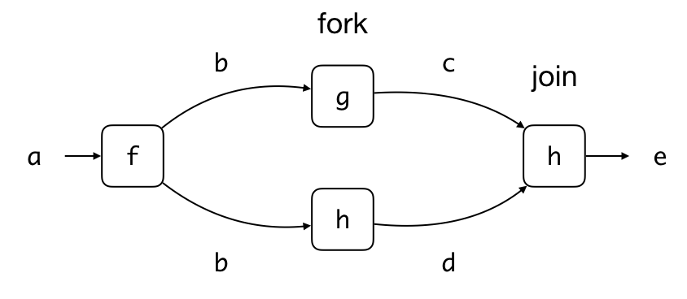

# Lecture 10: Parallel Streams

## Learning Objectives

After attending this lecture, students should:

- be aware that a program can be broken into subtasks to run parallelly and/or concurrently 
- be aware of the issues caused by running the subtasks parallelly and concurrently.
- be aware of that there exist tradeoffs in the number of subtasks and the processing overhead.
- be familiar with how to process a stream parallelly and correctly.
- be familiar with the Java's fork/join framework. 

## Parallel and Concurrent Programming

So far, the programs that we have written in CS2030 run _sequentially_.  What this means is that at any one time, there is only one instruction of the program running on a processor.  

### What is concurrency?

A single core processor can only execute one instruction at one time -- this means that only one _process_  (or less precisely speaking, one application) can run at any one time.  Yet, when we use the computer, it _feels_ as if we are running multiple processes at the same time.  The operating system, behind the scene, is actually switching between the different processes, to give the user an illusion that they are running at the same time.

We can write a program so that it runs concurrently -- by dividing the computation into subtasks called _threads_.  The operating system, behind the scene, can switch between the different threads, to give the user an illusion that the threads are running at the same time.  Such multi-threads programs are useful in two ways: (i) it allows us, the programmers, to separate the unrelated tasks into threads, and write each thread separately; (ii) it improves the utilization of the processor.  For instance, if I/O is in one thread, and UI rendering is in another, then when the processor is waiting for I/O to complete, it can switch to the rendering thread to make sure that the slow I/O does not affect the responsiveness of UI.

### What is parallelism?

While concurrency gives the illusion of subtasks running at the same time, parallel computing refers to the scenario where multiple subtasks are truly running at the same time -- either we have a processor that is capable of running multiple instructions at the same time, or we have multiple cores / processors and dispatch the instructions to the cores / processors so that they are executed at the same time.

All parallel programs are concurrent, but not all concurrent programs are parallel.

Modern computers have more than one core/processor[^1].  As such, the line between parallelism and concurrency is blurred.

[^1]: iPhone X comes with A11 Bionic chip with six cores.  The fastest supercomputer in the world as of this writing, the Sunway TaihuLight (神威 太湖之光), has 40,960 processors, each with 256 cores, giving a total of 10,485,760 cores.  

### Parallel computing

Parallel computing is one of the major topics in computer science.  One can teach a whole module (or a focus area) on this topic alone.  The goal of this lecture is not to cover it in depth, but is to expose students in CS2030 to the concept of parallel computing in relation to the stream abstraction in Java 8.

## Parallel Stream 

We have seen that Java `Stream` class is a powerful and useful class for processing data in declarative style.  But, we have not fully unleashed the power of `Stream`.  The neatest thing about `Stream` is that it allows parallel operations on the elements of the stream in one single line of code.  

Let's consider the following program that prints out all the prime numbers between 2,030,000 and 2,040,000.

```Java
    IntStream.range(2_030_000, 2_040_000)
        .filter(x -> isPrime(x))
        .forEach(System.out::println);
```

We can parallelize the code by adding the call `parallel()` into the stream.

```Java
    IntStream.range(2_030_000, 2_040_000)
        .filter(x -> isPrime(x))
        .parallel()
        .forEach(System.out::println);
```

You may observe that the output has been reordered, although the same set of numbers are still being produced.  This is because `Stream` has broken down the numbers into subsequences, and run `filter` and `forEach` for each subsequence in parallel.  Since there is no coordination among the parallel tasks on the order of the printing, whichever parallel tasks that complete first will output the result to screen first, causing the sequence of numbers to be reordered.

If you want to produce the output in the order of input, use `forEachOrdered` instead of `forEach`, we will lose some benefits of parallelization because of this.

Suppose now that we want to compute the number of primes between 2,030,000 and 2,040,000.  We can run:

```Java
    IntStream.range(2_030_000, 2_040_000)
        .filter(x -> isPrime(x))
        .parallel()
        .count()
```

The code above produces the same output regardless of it is being parallelized or not.  

Note that the task above is stateless and does not produce any side effect.  Furthermore, each element is processed individually without depending on other elements.  Such computation is sometimes known as _embarrassingly parallel_.  The only communication needed for each of the parallel subtasks is to combine the result of `count()` from the subtasks into the final count (which has been implemented in `Stream` for us.

### How to parallelize a stream

You have seen that adding `parallel()` to the chain of calls in a stream enables parallel processing of the stream.  Note that `parallel()` is a lazy operation -- it merely marks the stream to be processed in parallel.  As such, you can insert the call to `parallel()` anywhere in the chain.

!!! note "sequential()"
    There is a method `sequential()` which marks the stream to be process sequentially.  If you call both `parallel()` and `sequential()` in a stream,
    the last call "wins".  The example below processes the stream 
    sequentially:
    ```
    s.parallel().filter(x -> x < 0).sequential().forEach(..); 
    ```

Another way to create a parallel stream is to call the method `parallelStream()` instead of `stream()` of the `Collector` class.  Doing so would create a stream that will be processed in parallel from the collection.

### What can be parallelized?

To ensure that the output of the parallel execution is correct, the stream operations must not _interfere_ with the stream data, and most of time must be _stateless_.  Side-effects should be kept to a minimum.

### Interference
Interference means that one of the stream operation modifies the source of the stream during the execution of the terminal operation.  For instance:

```Java
List<String> list = new ArrayList<>(List.of("Luke", "Leia", "Han"));
list.stream()
    .peek(name -> {
         if (name.equals("Han")) {
           list.add("Chewie"); // they belong together
         }
      })
    .forEach(i -> {});
```

Would cause `ConcurrentModificationException` to be thrown.  Note that this non-interference rule applies even if we are using `stream()` instead of `parallelStream()`.

### Stateless
A stateful lambda is one where the result depends on any state that might change during the execution of stream.

For instance, the `generate` and `map` operations below are stateful, since they depend on the events in the queue and the states of the shops.  Parallelizing this may lead to incorrect output.  To ensure that the output is correct, additional work needs to be done to ensure that state updates are visible to all parallel subtasks.

```Java
Stream.generate(this.events::poll)
    .takeWhile(event -> event != null)
    .filter(event -> event.happensBefore(sim.expireTime())) 
    .peek(event -> event.log())
    .map(event -> sim.handle(event))
    .forEach(eventStream -> this.schedule(eventStream));
```

### Side Effects
Side-effects can lead to incorrect results in parallel execution.  Consider the following code:

```Java
List<Integer> list = new ArrayList<>(
    Arrays.asList(1,3,5,7,9,11,13,15,17,19));
List<Integer> result = new ArrayList<>();
list.parallelStream()
    .filter(x -> isPrime(x))
    .forEach(x -> result.add(x));
```

The `forEach` lambda generates a side effect -- it modifies `result`.  `ArrayList` is what we call a non-thread-safe data structure.  If two threads manipulate it at the same time, an incorrect result may result.

There are two ways to resolve this.  One, we can use the `.collect` method 
```Java
list.parallelStream()
    .filter(x -> isPrime(x))
	.collect(Collectors.toList())
```
Second, we can use a thread-safe data structure.  Java provides several in `java.util.concurrent` package, including `CopyOnWriteArrayList`.

```Java
List<Integer> result = new CopyOnWriteArrayList<>();
list.parallelStream()
    .filter(x -> isPrime(x))
    .forEach(x -> result.add(x));
```

### Associativity
The `reduce` operation is inherently parallelizable, as we can easily reduce each sub-streams and then use the `combiner` to combine the results together.  Consider this example:

```Java
Stream.of(1,2,3,4).reduce(1, (x,y)->x*y, (x,y)->x*y);
```

In order to allow us to run `reduce` in parallel, however, there are several rules that the `identity`, the `accumulator` and the `combiner` must follow:

- `combiner.apply(identity, i)` must be equal to `i`.
- The `combiner` and the `accumulator` must be associative -- the order of applying must not matter.
- The `combiner` and the `accumulator` must be compatible -- `combiner.apply(u, accumulator.apply(identity, t))` must equal to `accumulator.apply(u, t)`

The multiplication example above meetings the three rules:
    
- `i * 1` equals `i`
- `(x * y) * z` equals `x * (y * z)`
- `u * (1 * t)` equals `u * t`

## Performance of Parallel Stream

Let's go back to:

```Java
IntStream.range(2_030_000, 2_040_000)
    .filter(x -> isPrime(x))
    .parallel()
    .count()
```
 
How much time can we save by parallelizing the code above?

Let's use the [`Instant`](https://docs.oracle.com/javase/9/docs/api/java/time/Instant.html) and [`Duration`](https://docs.oracle.com/javase/9/docs/api/java/time/Duration.html) class from Java to help us:

```Java
    Instant start = Instant.now();
    long howMany = IntStream.range(2_000_000, 3_000_000)
        .filter(x -> isPrime(x))
        .parallel()
        .count();
    Instant stop = Instant.now();
    System.out.println(howMany + " " + Duration.between(start,stop).toMillis() + " ms");
```

The code above measures roughly the time it takes to count the number of primes between 2 million and 3 million.  On my iMac, it takes slightly more than 1 seconds.  If I remove `parallel()`, it takes about 450-550 ms.  So we gain about 50% performance.

Can we parallelize some more?  Remember how we implement `isPrime`[^2]

```Java
  boolean isPrime(int n) {
    return IntStream.range(2, (int)Math.sqrt(n) + 1)
        .noneMatch(x -> n % x == 0);
  }
```

Let's parallelize this to make this even faster!

```Java
  boolean isPrime(int n) {
    return IntStream.range(2, (int)Math.sqrt(n) + 1)
        .parallel()
        .noneMatch(x -> n % x == 0);
  }
```

[^2]: This is a more efficient version of the code you have seen, since it stops testing after the square root of the $n$.

If you run the code above, however, you will find that the code is not as fast as we expect. On my iMac, it takes about 18s, about 18 times slower!

_Parallelizing a stream does not always improve the performance_.

To understand why, we have to delve a bit deeper into how Java implements the parallel streams.  We are going to take a detour to see some parallel programming concepts and important Java classes related to parallel programming first.

## Fork and Join

Suppose we have the following code:

```Java
b = f(a);
c = g(b);
d = h(b);
e = i(c,d);
```

which we could visualize as a _computation graph_, which looks like the following:



It should be clear that `f(a)` has to be invoked before `g(b)` and `h(b)`, and `i(c,d)` has to be invoked after both `g(b)` and `h(b)` complete.  What about the order of `g(b)` and `h(b)`? 

Suppose that `g()` and `h()` are pure functions, i.e., the outputs `c` and `d` only depend on `b` and nothing else, and `g()` and `h()` does not produce any side effects, then we can safely conclude that `g(b)` and `h(b)` can be invoked in any order.  Not only that, they can be invoked in parallel, independently from each other.

To express that we wish to run `g()` in parallel to `h()` , we can _fork_ the task `g()` -- this means that we tell JVM that it _could_[^3] execute `g()` at the same time as `h()`.  

[^3]: The operating systems and JVM can decide this depends on how many cores or processors are available and how many tasks are pending.  But these details are hidden from us so we do not need to worry about them unless we want to squeeze some performance out of this -- in which case you should to take CS2106 and CS3210.

We can then _join_ back the task `g()`.  The join operation causes our code to wait for `g()` to complete, ensuring that the updated value of `c` is available when `i(c,d)` is called.

This pattern of invoking tasks in parallel is called the fork/join framework.  It typically involves some recursive forking and joining to break down a huge task to many smaller ones (but don't have to).  We will see a more concrete example below.

### The `ForkJoinTask<V>` Abstract Class

Java provides an abstraction for a task that can be forked and joined, aptly called [`ForkJoinTask`](https://docs.oracle.com/javase/10/docs/api/java/util/concurrent/ForkJoinTask.html).  This is an abstract class, which we will not use directly.  The class has many methods, but the two most important ones, which we will use, are `fork()` and `join()`.  The method `fork()` submits this task to JVM for execution, possibly parallely.  The method `join()` waits for the computation to complete and returns the value of type `V`.

### The `RecursiveTask<V>` Abstract Class

A `ForkJoinTask<V>` has a subclass called `RecursiveTask<V>`, which is also abstract.  It has a method `V compute()`, which we can customize with the task we want for compute.

Here is an example task of how we can use `RecursiveTask<V>`

```Java
  static class Summer extends RecursiveTask<Integer> {
    final int FORK_THRESHOLD = 2;
    int low;
    int high;
    int[] array;

    Summer(int low, int high, int[] array) {
      this.low = low;
      this.high = high;
      this.array = array;
    }

    @Override
    protected Integer compute() {
      // stop splitting into subtask if array is already small.
      if (high - low < FORK_THRESHOLD) {
        int sum = 0;
        for (int i = low; i < high; i++) {
          sum += array[i];
        }
        return sum;
      } 

      int middle = (low + high) / 2;
      Summer left = new Summer(low, middle, array);
      Summer right = new Summer(middle, high, array);
      left.fork();
      return right.compute() + left.join();
    }
  }
```

To run the task, we call `compute()` 

```Java
    Summer task = new Summer(0, array.length, array);
    int sum = task.compute();
```

!!! note "RecursiveAction"
    Another subclass of `ForkJoinTask` is called `RecursiveAction`, which is very similar to `RecursiveTask`, except that `RecursiveAction` does not return a value.

### Thread Pools and Fork/Join

Internally, Java maintains a pool of _worker threads_.  A worker thread is an abstraction for running a task.  We can submit a task to the pool for execution, the task will join a queue.  There is a global queue for a newly submitted task.  There is also a queue for each worker.   A task spawn from another task executed by a worker will join the queue belonging to that worker.  

The worker thread can pick a task from the queue to execute.  When it is done, it picks another task, if one exists in the queue, and so on -- not unlike our `Server` (worker thread) and `Customer` (task).  A `ForkJoinPool` is a class the implements a thread pool for `ForkJoinTask`.  An alternative way of executing the `sumTask` above is to submit the task to the `ForkJoinPool` instead of calling it directly.

```Java
int sum = ForkJoinPool.commonPool().invoke(task);
```

The difference between calling `invoke(task)` versus `task.compute()` is huge, even though both returns us the correct result above.  Calling `task.compute()` means that we are invoking the task immediately and directly (just like any method call); Calling `invoke(task)`, however, means that we are asking the task to join a queue, waiting to be carried out by a worker, and return us the result.  You can see this effect if we have too many recursive tasks, in which case if we call `task.compute` we will end out with a stack overflow.


### Overhead of Fork/Join

You can see from the description above that forking and joining actually creates additional overhead -- we first need to wrap the computation in an object, submit the object to a queue of tasks.  There are workers that go through the queue to execute the tasks.  You can try different values of `FORK_TRESHOLD` to look at the effect.  Here is what the result looks like on my iMac: 


The smaller the fork threshold, the more tasks we create, and the smaller each task becomes.  As the figure shows, if the task to parallelize is too simple, it is not worth to parallelize it due to the overhead cost. 

## Parallel Stream using Fork/Join

Parallel streams are implemented using fork/join in Java.  Here, `fork` creates subtasks running the same chain of operations on sub-streams, and when done, run `join` to combine the results (e.g., `combiner` for `reduce` is run in `join`).  `fork` and `join` can be recursive -- for instance, a `fork` operation can split the stream into two subtasks.  The subtasks can further split the sub-streams into four smaller sub-streams, and so on, until the size of the sub-stream is small enough that the task is actually invoked.

In the `isPrime` example earlier, the task is trivial (checking `n % x == 0`), and so, by parallelizing it, we are actually creating more work for Java to do.  It is much more efficient if we simply check for `n % x == 0` sequentially.

The moral of the story is, parallelization is worthwhile if the task is complex enough that the benefit of parallelization outweighs the overhead.  While we discuss this in the context of parallel streams, this principle holds for all parallel and concurrent programs.

## Ordered vs. Unordered Source

Whether or not the stream elements are _ordered_ or _unordered_ also plays a role in the performance of parallel stream operations.  A stream may define an _encounter order_.  Streams created from `iterate`, ordered collections (e.g., `List` or arrays), from `of`, are ordered.  Stream created from `generate` or unordered collections (e.g., `Set`) are unordered.

Some stream operations respect the encounter order.  For instance, both `distinct` and `sorted` preserve the original order of elements (if ordering is preserved, we say that an operation is _stable_).

The parallel version of `findFirst`, `limit`, and `skip` can be expensive on ordered stream, since it needs to coordinate between the streams to maintain the order.  

If we have an ordered stream and respecting the original order is not important, we can call `unordered()` as part of the chain command to make the parallel operations much more efficient.

The following, for example, takes about 700 ms on my iMac:

```Java
    Stream.iterate(0, i -> i + 7)
        .parallel()
        .limit(10_000_000)
        .filter(i -> i % 64 == 0)
        .forEachOrdered(i -> { });
```

But, with `unordered()` inserted, it takes about 350ms, a 2x speed up!

```Java
    Stream.iterate(0, i -> i + 7)
        .parallel()
        .unordered()
        .limit(10_000_000)
        .filter(i -> i % 64 == 0)
        .forEachOrdered(i -> { });
```

## Exercise

1. The last two lines of `compute` of `Summer` class, which says:

    ```Java
        left.fork();
        return right.compute() + left.join();
    ```

    What would happen if we change these two lines to the following:

    (a). 
    ```Java
        return right.compute() + left.compute();
    ```

    (b). 
    ```Java
        right.fork();
        left.fork();
        return right.join() + left.join();
    ```

    (c ) 
    ```Java
        right.fork();
        return right.join() + left.compute();
    ```

2. What is the value of the variable `x` after executing the following statement? 
    ```Java
    Stream.of(1,2,3,4).reduce(0, (result, x) -> result * 2 + x);
    ```

    After we parallelized the above code into the following, we found the output is different.  Why?  
    ```Java
    Stream.of(1,2,3,4).parallel().reduce(0, (result, x) -> result * 2 + x);
    ```

3. Take the standard implementation of merge sort (e.g., from CS2040) and parallelize it with fork and join.
