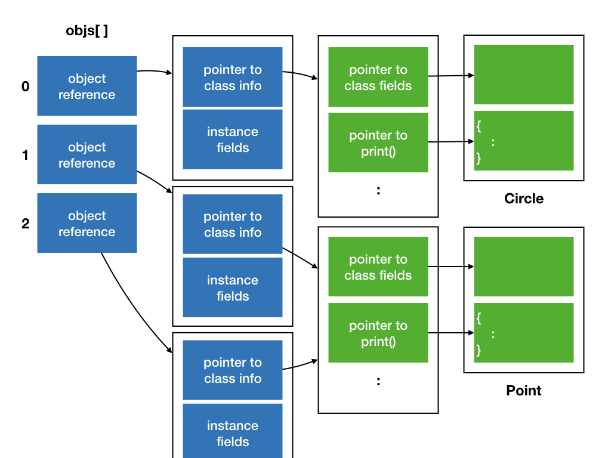
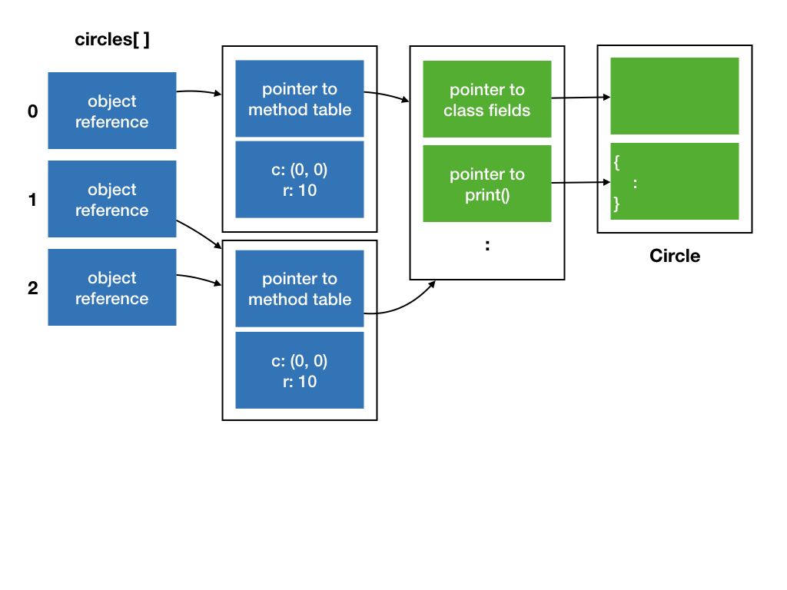

# Lecture 2: Inheritance & Polymorphism

## Learning Objectives

After this lecture, students should:

- understand that Java is a type-safe language, in contrast to C
- be familiar with Java variable and primitive types
- understand the concepts of object-oriented programming, including interface, polymorphism, late binding, inheritance, method overriding and method overloading, and their purposes of introducing them as a method of programming.
- know the purpose and usage of Java keywords `implements`, `extends`, `super`, `instanceof`, and `@Override`
- understand Java concepts of arrays, enhanced `for` loop, method signature, `Object` class, and object equality. 

## Type Safety

Recall that the _type_ of a variable tells the compiler how to interpret the bits that represent the value of a variable and how to manipulate the variable.  The compiler also uses the type to decide how much memory is allocated for each variable.  

Some languages are stricter in terms of type "compatibility" than others.  C compilers, however, are not very strict.  If it detects something strange with the type you used, it will issue a warning, but still let your code compiles and run.

Take:

```C
#include <stdio.h>
int main()
{
	printf("%d\n", "cs2030");
}
```

In Line 4, we treat the address to a string as integer.  This generates a compiler's warning.

In C, you can _type cast_ a variable from one type into another, i.e., force the compiler to treat a variable of one type as another type.  The compiler would listen and do that for you.  The following code would print out gibberish and would compile perfectly without error.

```C
#include <stdio.h>
int main()
{
	printf("%d\n", (int)"cs2030");
}
```

Such flexibility and loose rules for type compatibility could be useful, if you know what you are doing, but for most programmers, it could be a major source of unintentional bugs, especially if one does not pay attention to compiler's warning or one forces the warning to go away without fully understanding what is going on.

Java is very strict when it comes to type checking, and is one of the _type-safe_ languages. Java ensures that basic operations (such as `+`, `-`, etc) and method calls apply to values in a way that makes sense.  If you try to pull the same trick as above, you will receive an error:

<script type="text/javascript" src="https://asciinema.org/a/133995.js" id="asciicast-133995" async></script>

!!! note "Java Primitive Data Types"
    Java supports eight _primitive_ data types: `byte`, `short`, `int`, `long`, `float`, `double`, `boolean` and `char`.  If you are familiar with C, these data types should not be foreign to you.  One important difference is that a `char` variable stores a 16-bit Unicode character, not an 8-bit character like in C.  Java uses `byte` for that.  The other notable difference is that Java defines `true` and `false` as possible value to a `boolean`, unlike C which uses `0` for false and non-`0` for true.  

	You can read all about Java [variables](https://docs.oracle.com/javase/tutorial/java/nutsandbolts/variables.html) and [primitive data types](https://docs.oracle.com/javase/tutorial/java/nutsandbolts/datatypes.html) in Oracle's Java Tutorial.


## Enforcing Abstraction Barrier with Interface

Recall the concept of encapsulation. When we develop a large piece of software, it is important to hide the details about data representation and implementation, and only exposes certain `public` methods for the users to use.  We imagine that there is an abstraction barrier between the code that implements the internals of a class (called the _implementer_) and the code that uses the class (called the _user_) to achieve a higher level task.

We have seen that we use `private` to enforce data hiding -- to hide certain fields and methods from outside of the barrier.  Now, we are going to see how we enforce that the right set of methods are defined, implemented, and used on both sides of the barrier.

The mechanism to do this is through defining an _interface_ (aka a _protocol_ as it is called in Objective-C or Swift).  An interface is kinda like a contract between the implementer of a class and the user of a class.  If a class promises to implement an interface, then we are guaranteed that the methods defined in the interface are implemented in the class as it is promised.  Otherwise, the code would not compile.

In Java, we can define an interface using `interface` keyword:

```Java
interface GeometricShape {
	public double getArea();
	public double getPerimeter();
	public boolean contains(Point p);
}
```

The example interface `GeometricShape` above contains only the declaration of the methods, not the implementation.  

Now, let's see how the implementer would implement a class using the interface.

```Java
import java.lang.Math;
class Circle implements GeometricShape {
	private Point center;
	private double radius;

	public Circle(Point initCenter, double initR) {
		center = initCenter;
		radius = initR;
	}

    void moveTo(Point p) {
		center = p;
	}

	@Override
	public double getArea() {
		return Math.PI*radius*radius;
	}

	@Override
	public boolean contains(Point p) {
		return (p.distance(center) < radius);
	}

	@Override
	public double getPerimeter() {
		return Math.PI*2*radius;
	}
}
```

This is very similar to the code you saw in Lecture 1 and Exercise 1, except that in Line 2, we say that `class Circle implements GeometricShape`.  This line informs the compiler that the programmer intends to implement all the methods included in the interface `GeometricShape` exactly as declared (in terms of names, the number of arguments, the types of arguments, returned type, and access modifier).  The rest of the class is the same, except that we renamed `getCircumference` with `getPerimeter`, which is more general and apply to all shapes.  You will also see that we added _annotations_ to our code by adding the line `@Override` before methods in `Circle` that implements the methods declared in `GeometricShape`.  This annotation is optional, but it informs our intention to the compiler and helps make the intention of the programmer clearer to others who read the code.

!!! note "Java Annotation"
    Annotations are metadata we add that is not part of the code.  Annotation does not affect execution.  They are useful to compilers and other software tools, as well as humans who read the code.  While we can similarly make the code more human-friendly with comments, an annotation is structured and so can be easily parsed by software.  `@Override` is probably going to be the only annotation useful for us in this class.

Note that we can have other methods (such as `moveTo`) in the class beyond what is promised in the interface the class implements.

A class can implement more than one interfaces.  For instance, let's say that we have another interface called `Printable`[^1] with a single method defined:

```
interface Printable {
	public void print();
}
```

The implementer of `Circle` wants to inform the users that the method `void print()` is implemented, it can do the following:

```Java
class Circle implements GeometricShape, Printable {
	 :
	 :
	 @Override
	 public void print() {
		 System.out.printf("radius: %f\n", radius);
		 System.out.printf("center:");
		 center.print();
	 }
}
```

In the above, we call `print()` on the `Point` object as well.  How do we know that `Point` provides a `print()` method?  Well, we can read the implementation code of `Point`, or we can agree with the implementer of `Point` that `Point` provides a `Printable` interface!  

It is important to know that, `interface` provides a _syntactic_ contract on the abstraction barrier, but it does not provide a _semantic_ contract.  It does not, for instance, guarantee that `print()` actually prints something to the screen.  One could still implement interface `Printable` as follows:

```Java
class Circle implements GeometricShape, Printable {
	 :
	 :
	 @Override
	 public void print() {
	 }
}
```

and the code still compiles!

Not all programming languages that support classes support interface.  Javascript and Python, for instance, does not support similar concepts.

## Interface as Types

In Java, an interface is a type.  What this means is that:

- We can declare a variable with an interface type, such as:
```Java
	GeometricShape circle;
```
or
```Java
	Printable circle;
```
We cannot, however, instantiate an object from an interface
since an interface is a "template", an "abstraction", and does not have an implementation.  For instance:

```Java
	// this is not OK
	Printable p = new Printable();
	// this is OK
	Printable circle = new Circle(new Point(0, 0), 10);
```

- Similarly, we can pass arguments of an interface type into a method, and the return type of a method can be an interface.

- An object can be an instance of multiple types.  Recall that Java is a statically typed language. We associate a type with a variable.  We can assign a variable to an object if the object is an instance of the type of the variable.  Line 4 above, for instance, creates a new circle, which is an instance of three types: `Circle`, `GeometricShape`, and `Printable`.  It is ok to assign this new circle to a variable of type `Printable`.

We can now do something cool like this:
```Java
	Printable[] objectsToPrint;
	  :
	  // initialize array objectsToPrint
    :
	for (Printable obj: objectsToPrint) {
		obj.print();
	}
```

Let's look at this code in more details.  Line 1 declares an array of objects of type `Printable`.  We skip over the code to initialize the content of the array for now, and
jump to Line 5-7, which is a `for` loop.  Line 5 declares a loop variable `obj` of type `Printable` and loops through all objects in the array `objectsToPrint`, and Line 6 invoke the method `print` of `obj`.

!!! note "Array and For Loops in Java"
	See Oracle's tutorial on [array](https://docs.oracle.com/javase/tutorial/java/nutsandbolts/arrays.html) and [enhanced loop](h]ttps://docs.oracle.com/javase/tutorial/java/nutsandbolts/for.html)

The magic happens in Line 6:

- First, since we now that any object in the array has the type `Printable`, this means that they must implement the `Printable` interface and support the method `print()`.  
- Second, we do not know, and we do not _need_ to know which class an object is an instance of.
- Third, we can actually have objects of completely unrelated classes in the same array. We can have objects of type `Circle`, and objects of type `Point`.  We can have objects of type `Factory`, or objects of type `Student`, or objects of type `Cushion`.  As long as the objects implement the `Printable` interface, we can put them into the same array.
- Forth, at _run time_, Java looks at `obj`, and determines its class, and invoke the right implementation of `print()` corresponding to the `obj`.  That is, if `obj` is an instance of a class `Circle`, then it will call `print()` method of `Circle`; if `obj` is an instance of a class `Point`, then it will call `print()` method of `Point`, and so on.

To further appreciate the magic that happens in Line 6, especially the last point above, consider how function call is done in C.  In C, you cannot have two functions of the same name within the same scope, so if you call a function `print()`, you know exactly which set of instructions will be called[^2].  So, the name `print` is bound to the corresponding set of instructions at compilation time.  This is called _static binding_ or _early binding_.
To have `print()` for different types, we need to name them differently to avoid naming conflicts: e.g., `print_point()`, `print_circle()`.

[^2]: Remember a function is just an abstraction over a set of instructions.

In a language with static binding, suppose you want to mix objects of different types
together in an array, you need to do something like the following pseudocode:
```C
   for each object in the array
	   if object is a point
		   print_point(object)
	   else if object is a circle
		   print_circle(object)
       else if object is a square
		   print_square(object)
		   :
		   :
```

Not only is the code verbose and ugly, if you want to define a new compound data type that supports printing, you need to remember to come to this place and add in a new condition and call the corresponding print function.

In OO languages, you can have methods named `print()` implemented differently in different classes.  When we compile the code above, the compiler will have no way to know which implementation will be called.  The bindings of `print()` to the actual set of instructions will only be done at run time, after `obj` is instantiated from a class.  This is known as _dynamic binding_, or _late binding_, or _dynamic dispatch_.



If you understand how an object is represented internally, this is not so magical after all.  Referring to the figure above, the array `objectsToPrint[]` contains an array of references to objects, the first one is a `Circle` object, and the next two are `Point` objects.  When `obj.print()` is invoked, Java refers to the method table, which points to either the method table for `Circle` or for `Point`, based on the class the object is an instance of.

This behavior, which is common to OO programming languages, is known as _polymorphism_[^3].

[^3]: In biology, polymorphism means that an organism can have many different forms.

## DRY - Don't Repeat Yourself

With the interface `GeometricShape`, we can implement other classes, such as `Rectangle`, `Square`, `Polygon` with the same interface.  For instance,

```Java
class Square implements GeometricShape, Printable {
		 // left as exercise (See Exercise 2)
}
```

So far, we have been treating our shapes as pure geometric objects.  Let's consider an application where we want to paint the shapes.  Each shape should have a fill color and a border (with color and thickness).

```Java
import java.awt.Color;
    :

class PaintedCircle implements GeometricShape, Printable {
  private Color  fillColor;
	private Color  borderColor;
	private double borderThickness;

	public void fillWith(Color c) {
		fillColor = c;
	}

	public void setBorderThickness(double t) {
		borderThickness = t;
	}

	public void setBorderColor(Color c) {
		borderColor = c;
	}

	// other methods and fields for Circle from before

}
```

In the code above, we added the line `import java.awt.Color` to use the [Color class](https://docs.oracle.com/javase/8/docs/api/java/awt/Color.html) that Java provides, and added three private members as well as their setters.

We can do the same for `Square`

```Java
import java.awt.Color;
    :

class PaintedSquare implements GeometricShape, Printable {
  private Color  fillColor;
	private Color  borderColor;
	private double borderThickness;

	public void fillWith(Color c) {
		fillColor = c;
	}

	public void setBorderThickness(double t) {
		borderThickness = t;
	}

	public void setBorderColor(Color c) {
		borderColor = c;
	}

	// other methods and fields written for Square

}
```

and for other shapes.

Great!  We now have colorful shapes.  The code above, however, is not _good_ code, even though it is _correct_.  Consider what would need to be done if say, we decided to support border styles (dotted border, solid border, dashed border, etc).  We would have to edit every single class that supports colors and borders.!

One principle that we can follow is the _abstraction principle_, which says "Each significant piece of functionality in a program should be implemented in just one place in the source code. Where similar functions are carried out by distinct pieces of code, it is generally beneficial to combine them into one by abstracting out the varying parts."[^4]

[^4]: This principle is formulated by Benjamin C. Pierce in his book _Types and Programming Languages_.

Following the principle, we want to implement these style-related fields and methods in just one place.  But where?

## Inheritance

The OO-way to do this is to create a _parent class_, and put all common fields and methods into the parent.  A parent class is defined just like a normal class.  For instance:

```Java
class PaintedShape {
  private Color  fillColor;
	private Color  borderColor;
	private double borderThickness;

  public PaintedShape(Color initFillColor, Color initBorderColor, double initBorderThickness) {
		fillColor = initFillColor;
		borderColor = initBorderColor;
		borderThickness = initBorderThickness;
	}

	public void fillWith(Color c) {
		fillColor = c;
	}

	public void setBorderThickness(double t) {
		borderThickness = t;
	}

	public void setBorderColor(Color c) {
		borderColor = c;
	}
}
```

The `PaintedCircle` class, `PaintedSquare` class, etc, can now _inherits_ non-private fields and methods from the parent class, using the `extends` keyword.  
```Java

class PaintedCircle extends PaintedShape implements GeometricShape, Printable {
	  :
}

class PaintedSquare extends PaintedShape implements GeometricShape, Printable {
	  :
}
```

This mechanism for a class to inherit the properties and behavior from a parent is called _Inheritance_, and is the forth and final basic OO principles we cover[^5].

[^5]: The other three is encapsulation, abstraction, and polymorphism.

With inheritance, we do not have to repeat the declaration of fields `fillColor`, `borderColor`, `borderThickness` and the associated methods in them.  This software engineering principle is also known as the DRY principle -- "_don't repeat yourself_" principle.  We are going to see DRY again and again in future lectures.

We also call the `PaintedShape` the superclass (or base class) of `PaintedCircle` and `PaintedSquare`, and call `PaintedCircle` and `PaintedSquare` the subclass (or derived class)[^6] of `PaintedShape`.

[^6]: Again, you see that computer scientist can be quite indecisive when it comes to the terminologies in OOP.

A `PaintedCircle` object can now call `fillWith()` even if the method `fillWith()` is not defined in `PaintedCircle` -- it is defined in `PaintedCircle`'s parent `PaintedShape`.  

Now consider the constructor for `PaintedCircle`.   We need to initialize the geometric shape as well as the painting style.  But, we define the fields `fillColor`, etc `private`, and subclasses have no access to `private` fields in the parent.  We need to call the constructor of the parent to initialize these private fields.  The way to do this is to use the `super` keyword, like such:

```Java
  public PaintedCircle(Point initCenter, double initRadius, Color initFillColor, Color initBorderColor, double initBorderThickness) {
		super(initFillColor, initBorderColor, initBorderThickness);
		c = initCenter;
		r = initRadius;
	}
```

You can see that the constructor for `PaintedCircle` now takes in five parameters.  You can imagine that as the class get more sophisticated with more fields, we need to pass in more parameters to the class to initialize the fields.  It is not uncommon to provide alternative constructors with fewer parameters and assign some _default_ values to the fields.

```Java
  // create circle with default style (white with black border of thickness 1)
  public PaintedCircle(Point initCenter, double initRadius) {
	  super(Color.WHITE, Color.BLACK, 1.0);
	  c = initCenter;
	  r = initRadius;
  }

	// create circle with customized styles  
  public PaintedCircle(Point initCenter, double initRadius, Color initFillColor, Color initBorderColor, double initBorderThickness) {
		super(initFillColor, initBorderColor, initBorderThickness);
		c = initCenter;
		r = initRadius;
	}
```

Two methods in a class can have the same name and still co-exist peacefully together.  This is called _overloading_.  When a method is called, we look at the _signature_ of the method, which consists of (i) the name of the method, (ii) the number, order, and type of the arguments, to determine which method is called.  To be precise, the first sentence of this paragraph should read: Two methods in a class can have the same name and still co-exist peacefully together, as long as they have different signatures.  Note that the return type is not part of the method signature, so you cannot have two methods with the same name and same arguments but different return type.  

Even though the example above shows overloading of the constructor, we can overload other methods as well.

## Java `Object` class

In Java, every class inherits from the [class `Object`](https://docs.oracle.com/javase/8/docs/api/java/lang/Object.html) implicitly.  The `Object` class defines many useful methods that are common to all objects.  The two useful ones are :

- `equals(Object obj)`, which checks if two objects are equal to each other, and
- `toString()`, which returns a string representation of the object, and is a better way to print an object than the `print()` method and `Printable` interface we write[^7].

[^7]: We leave this for another lesson on another day.  

The `equals()` method as implemented in `Object`, only compares if two object references refer to the same object In the Figure below, we show an array `circles` with three `Circle` objects.  All three circles are centered at (0, 0) with radius 10.  They are created as follows:

```Java
	Circle[] circles = new Circle[3];
	circles[0] = new Circle(new Point(0, 0), 10);
	circles[1] = new Circle(new Point(0, 0), 10);
	circles[2] = circles[1];
```

When you check `circles[0].equals(circles[1])`, however, it returns `false`, because even though `circles[0]` and `circles[1]` are semantically the same, they refer to the two different objects.  Calling `circles[1].equals(circles[2])` returns `true`, as they are referring to the same object.  



What if you need a method that compares if two circles are semantically the same?  You can implement your own method, say `isTheSameCircle(Circle c)`.  But, the `equals()` method is universal (all classes inherits this method) and is used by other classes for equality tests.  So, in most cases, we can implement a method called `equals()` with the same signature with the semantic that we want[^8].

That's right.  Even though we cannot have two methods with the same signature in the same class, we can have two methods with the same signature, one in the superclass (or the superclass's superclass, and so on), one in the subclass.  The method in the subclass will override the method in the superclass.  For example,


```Java
	class Circle implements Shape, Printable {
     :
		 @Override
		 public boolean equals(Object obj) {
			 if (obj instanceof Circle) {
				 Circle circle = (Circle) obj;
				 return (circle.center.equals(center) && circle.radius == radius);
			 } else
			   return false;
		 }
	}
```

Line 7 above compares if the two center points are equals, and the two radius values are equals.  So, we compare if the two circles are semantically the same.  The rest of this code requires some explanation:

- Line 3 uses the same `@Override` annotation that we have seen before -- we are telling the compilers that we are overriding a method in the superclass.
- Line 4 declares the method `equals`, and note that it has to have exactly the same signature as the `equals()` method we are overriding.  Even though we meant to compare two `Circle` objects, we cannot declare it as `public boolean equals(Circle circle)`, since the signature is different and the compiler would complain.
- Since `obj` is of an `Object` type, we can actually pass in any object to compare with a `Circle`.  Line 5 checks if the comparison makes sense, by checking if `obj` is instantiated from a `Circle` class, using the `instanceof` keyword.  If `obj` is not even a `Circle` object, then we simply return `false`.
- If `obj` is an instance of `Circle`, we assign `obj` to a variable of type `Circle`, and compare as in Line 7.

For the code above to work, we have to override the `equals` method of `Point` as well.  That is left as an exercise.

One final note: polymorphism works here as well.  If we have an object reference `obj` of type `Object` that refers to an instance of a `Circle`, calling `obj.equals()` will invoke the `equals()` method of `Circle`, not `Object`, just like the case of interfaces.

[^8]: If you override `equals()` you should generally override `hashCode()` as well, but let's leave that for another lesson on another day.
