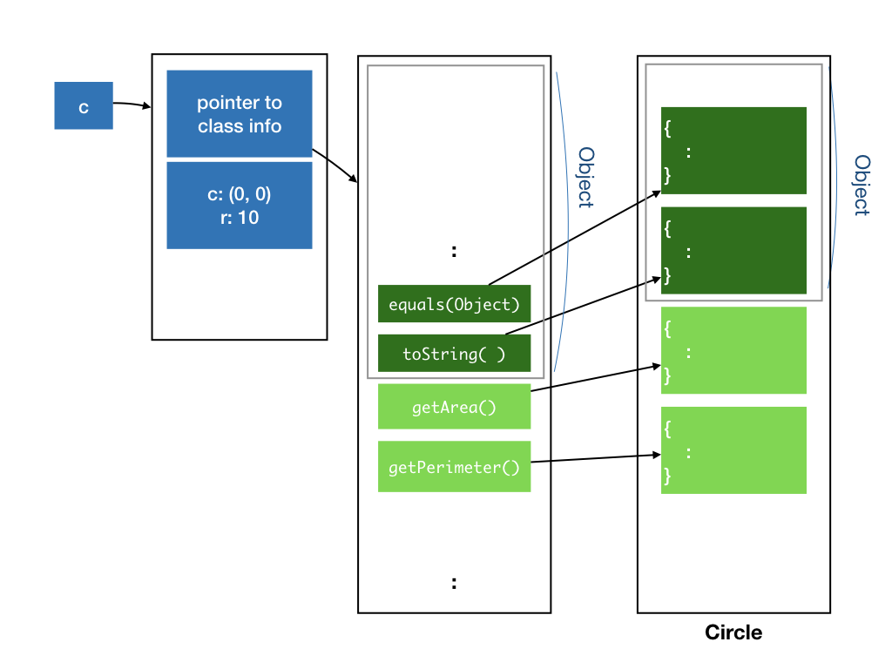

# Lecture 3: Inheritance, Continued

## Learning Objectives

At the end of this lecture, students should

- be familiar with how Java dispatches methods that have been overridden
- appreciate the usefulness of overriding `equals` and `toString` in the `Object` class
- be exposed to the `String` class and its associated methods, especially the `+` operator
- be aware that inheritance can be abused to provide bad code
- understand the differences between HAS-A and IS-A relationship
- be able to use composition to model classes with HAS-A relationship
- be able to use inheritance to model classes with IS-A relationship
- understand the Liskov Substitution Principle and thus be aware that not all IS-A relationship should be modelled with inheritance
- understand the purposes of the Java keywords `this`, `final`, `abstract` and `default`

## Method Overriding

During Lecture 2, I introduced the concept of inheritance.  Today, let's go deeper into how inheritance and its associated concepts work.

Consider the class `Circle`, which inherits from `Object`.  We have seen that `Object` defines some non-private methods, which can be inherited by `Circle`.
These methods will be made available in the `Circle` class.  In the internal representation of the class, the methods will be made available in the method table of `Circle`.  You can view the fields and methods of class `Circle` as containing the fields and methods of `Object`, followed by fields and methods defined in `Circle`.

The figure below illustrates this.  I use a slightly darker green to represent the methods implemented in the `Object` class, and light green to represent methods implemented in the `Circle` class.



Recall that when a class implements an interface, an instance of that class can take on the type of that interface.  Similarly, when a class inherits from a parent class, an instance of that class can take on the type of the parent class.  So, we can do the following:

```Java
Circle c = new Circle(new Point(0,0), 10);
Object o = c;
```

Line 2 assigns the circle object `c` to `o` of type `Object`.  So, both `o` and `c` are referring to the same objects.  Due to type checking at compile time, however, Java does not allow methods and fields in the subclass (e.g., `Circle`) that is not in the superclass (e.g., `Object`) to be called.  In this example, only the methods known to `Object` can be accessed by `o`.

Now, consider what would happen if we override the method `equals()` from the `Object` class.  This is what we did in the last lecture.

```Java
	class Circle implements Shape, Printable {
     :
		 @Override
		 public boolean equals(Object obj) {
			 if (obj instanceof Circle) {
				 Circle circle = (Circle) obj;
				 return (circle.center.equals(center) && circle.radius == radius);
			 } else
			   return false;
		 }
	}
```

!!! note "Equality for Point"
    Recall that we override `equals` because we want to compare the content of the two circles, instead of comparing if two circle references point to the same object.  For the implementation above to be correct, we need to override the `equals` function for the `Point` class as well.  This is not shown in class and left as an exercise.

The method table will update the entry for `equals()` to point to the implementation provided by the `Circle` class, instead of the `Object` class.


Now, consider what would happen if we _overload_ the method `equals()` with one that takes in a `Circle` object.  I also throw in a couple of `System.out.print()` to help us figure out what is going on.

```Java
	class Circle implements Shape, Printable {
     :
		 @Override
		 public boolean equals(Object obj) {
			 System.out.print("equals(Object) called\n");
			 if (obj instanceof Circle) {
				 Circle circle = (Circle) obj;
				 return ((circle.center.equals(center) && circle.radius == radius);
			 } else
			   return false;
		 }

		 public boolean equals(Circle circle) {
			 System.out.print("equals(Circle) called\n");
			 return ((circle.center.equals(center) && circle.radius == radius);
		 }
	}
```

Since this new `equals()` method does not override the method in `Object`, it gets its own slot in the method table of `Circle`, instead of reusing one from the `Object`.


Now, consider which version of `equals` are called by the following:

```Java
Circle c1 = new Circle(new Point(0,0), 10);
Circle c2 = new Circle(new Point(0,0), 10);
Object o1 = c1;
Object o2 = c2;

o1.equals(o2);
o1.equals((Circle)o2);
o1.equals(c2);
c1.equals(o2);
c1.equals((Circle)o2);
c1.equals(c2);
```

Lines 6-9 call `equals(Object)` defined in `Circle`， while Lines 10-11 call `equals(Circle)` defined in `Circle`.  Let's look at why for each one:

- Line 6 calls `equals` of an `Object` object on an `Object` object.  Java checks through all methods defined in `Object`, and finds a method that matches the signature, which is the `equals(Object)` (which `Circle` has overridden). This is the one that will get called.
- Line 7-8 call `equals` of an `Object` object on a `Circle` object.  Java checks through all methods defined in `Object`, and finds one method that matches the signature, which is `equals(Object)` (which `Circle` has overridden).  Even though there is another method `equals(Circle)` defined, it is defined as part of the `Circle` class, which Java refuses to access because `o1` is declared to have the type `Object`.  Since the only method that Java can find has an argument of type `Object`, the argument is cast as an `Object` when `equals` is invoked.
- Line 9 calls `equals` of a `Circle` object on an `Object` object.  Java finds a method with matching signature, `equals(Object)`, and invokes that.
- Final 10-11 calls `equals` of a `Circle` object on a `Circle` object.  Java finds a method with matching signature, `equals(Circle)`, and invokes that.

Another question that came up is why we need to override `equals` in `Object`, rather than just using the `Circle`-specific `equals(Circle)`.  As shown above, only when an object declared as `Circle` calls `equals` on another `Circle` object, the `Circle`-specific `equals(Circle)` is invoked.  

To write code that is general and reusable, we should exploit OO polymorphism, that means different subclasses of `Object` implement their own customized version of `equals`, and the right version of `equals` will be called.

One example of where this is called the `contains(Object)` method from class `ArrayList` (we will cover this later in class), which checks if an object is already in the list, and to check this, it checks for equality of the given object with every object in the `ArrayList`, by calling `equals(Object)`.

We now turn our attention to another method in `Object` that we could override, the `toString()` method.  `toString()` is called whenever the `String` representation of an object is needed.  For instance, when we try to print an object.   By default, the `toString` of `Object` simply prints the name of the class, followed by `@`, followed by the reference.   It is often useful to override this to include the content of the object as well, for debugging and logging purposes.  This is a much more useful and flexible than writing our own `print()` method as we have seen in earlier lectures, since we are not limited to printing to standard output anymore.

!!! note "java.lang.String"
    `String` is one of many useful classes provided by Java.  You can skim through to see what methods are available and keep the [API reference](https://docs.oracle.com/javase/8/docs/api/java/lang/String.html) handy.

```Java
class Point {
	:
	public String toString() {
		return "(" + x + "," + y ")";
	}
}
```

Now, if we run:
```Java
Point p = new Point(0,0);
System.out.println(p);
```

It should print `(0,0)` instead of `Point@1235de`.

The ability to override methods that you inherit from a parent, including root class `Object`, makes overriding an extremely powerful tool.  It allows you to change how existing libraries behave, and customize them to your classes, without changing a single line of their code or even has access to their code!

As Uncle Ben said, "With great power, comes great responsibility."  We must use overriding and inheritance carefully.  Since we can affect how existing libraries behave, we can easily break existing code and introduce bugs.  Since you may not have access to these existing code, it is often tricky to trace and debug.  

## Modeling HAS-A Relationship

Inheritance in OO tends to get overused.  In practice, we seldom use inheritance.  Let's look at some examples of how _not_ to use inheritance, and why.

You may come across examples online or in books that look like the following:

```Java
class Point {
	double x;
	double y;
	  :
}

class Circle extends Point {
	double radius;
	  :
}

class Cylinder extends Circle {
	double height;
	  :
}
```

`Circle` implemented like the above would have the center coordinate inherited from the parent (so it has three fields, x, y, and radius), and `Cylinder` would have the fields corresponding to a circle, which is its base, and the height.  So, we are _reusing_ the fields and the code related to initializing and manipulating the fields.

When we start to consider methods encapsulated with each object, things start to get less intuitive.  What does `getPerimeter()` and `getArea()` of `Cylinder` means?  How about `distanceTo` between a `Cylinder` and a `Point`?   What is the meaning of a `Circle` containing a `Cylinder`?

The inheritance hierarchy above actually models the HAS-A relationship: A circle has a center (which is a point), a cylinder has a base which is a circle.  Therefore, a better way to capture the relationship between the three types of objects is through _composition_:

```Java
class Point {
	double x;
	double y;
	  :
}

class Circle {
	Point center;
	double radius;
	  :
}

class Cylinder {
	Circle base;
	double height;
	  :
}
```

Composition allows us to build more complex classes from simpler ones, and is usually favored over inheritance.  

The `PaintedShape` class from Lecture 2, for instance, could be modeled as a composition of a `Style` object and `GeometricShape` object.

```Java
class Style {
	Color fillColor;
	Color borderColor;
	  :
}

class PaintedShape {
	Style style;
	GeometricShape shape;
	  :
	public double getArea() {
		return shape.getArea();
	}
    :
	public void fillWith(Color c) {
		style.fillWith(c);
	}
	  :
}
```

The design above is also known as the _forwarding_ -- calls to methods on `PaintedShape` gets forwarded to either `Style` or `GeometricShape` objects.

## Modeling IS-A Relationship

A better situation to use inheritance is to model a IS-A relationship: when the subclass behaves just like parent class, but has some additional behaviors.  For instance, it is natural to model a `PaintedCircle` as a subclass of `Circle` -- since a PaintedCircle has all the behavior of `Circle`, but has _additional_ behaviors related to being painted.

```Java
class PaintedCircle extends Circle {
	Style style;
	  :
}
```

A more tricky situation for modeling a IS-A relationship occurs when the subclass behaves just like the parent class _most_ of the time, but is slightly different than the parent's behavior.  Consider how do we model a rectangle and a square.  Normally, we consider a square IS-A special case of rectangle.  So, we could model as:

```Java
class Rectangle {
	double width, height;
	Point topLeft;
	Rectangle(Point topLeft, in width, int height) {
		this.topLeft = topLeft;
		this.width = width;
		this.height = height;
	}
}

class Square extends Rectangle {
	Square(Point topLeft, int width) {
		super(topLeft, width, width);
	}
}
```

!!! note "this"
    The `this` keyword in Java that refers to the current object.

So far, so good.

Now, suppose the two classes are written by two different developers.  The developer who wrote Rectangle decides to add the method `resizeTo`:

```Java
class Rectangle {
	  :
	void resizeTo(int width, int height) {
		this.width = width;
		this.height = height;
	}
}
```

This developer assumes the behavior that, after calling `resizeTo(w, h)`, the width of the rectangle will be `w` and the height will be `h`.  He/she publishes this API, and another developer then assumes this behavior, and wrote some code, like:

```Java
void doSomething(Rectangle r) {
	r.resizeTo(1, 2);
	  :
}
```
What should the developer who develops `Square` do?  Since `Square` is a subclass of rectangle, it would inherit `resizeTo` from its parent, but it does not make sense to call `resizeTo` with two different parameters.  Sure, `Square` can overload `resizeTo` and provide a `resizeTo` with one parameter only, but that does not prevent someone from calling `resizeTo` with two parameters on a `Square`.  Someone could do the following and the code would still compile and run, turning the square into a rectangle!

```Java
Square s = new Square(new Point(0,0), 10);
s.resize(4, 8);
```

The `Square` developer can try to override `resizeTo`, to ignore the second parameter:

```Java
class Square {
	  :
	void resizeTo(int width, int height) {
		this.width = width;
		this.height = width;
	}
}
```

This makes more sense and would make everyone who uses `Square` happy -- a square is always a square -- but it introduces an _inconsistency_ in behavior and will likely break another part of the code the developer is totally unaware of.  The developer for `doSomething` suddenly cannot assume that `resizeTo` works as intended and documented.

It is a developer's responsibility that any inheritance with method overriding does not alter the behavior of existing code.  This brings us to the Liskov Substitution Principle, which says that: "Let $\phi(x)$ be a property provable about objects $x$ of type $T$. Then $\phi(y)$ should be true for objects $y$ of type $S$ where $S$ is a subtype of $T$."   This means that if $S$ is a subclass of $T$, then an object of type $T$ can be replaced by an object of type $S$ without changing the desirable property of the program.

In the example above, this means that everywhere we can expect rectangles to be used, we can replace a rectangle with a square.  This was no longer true with the introduction of `resizeTo` method.

## Preventing Inheritance and Method Overriding

Sometimes, it is useful for a developer to explicitly prevent a class to be inherited.  Not allowing inheritance would make it much easier to argue for the correctness of programs, something important when it comes to writing secure program.  Both the two java classes you have seen, `java.lang.Math` and `java.lang.String`, cannot be inherited from.  In Java, we use the keyword `final` when declaring a class to tell Java that we ban this class from being inherited.

```Java
final class Circle {
	:
}
```

Alternatively, we can allow inheritance, but still prevent a specific method from being overridden, by declaring a method as `final`.  Usually, we do this on methods that are critical for the correctness of the class.

```Java
class Circle {
   :
	final public boolean contains(Point p) {
		:
	}
}
```

!!! note "final variable"
    The keyword `final` has another use.   When declaring a variable as `final`, just like
		`PI` in `Math`, it prevents the variable from being modified.  In other words, the variable becomes constant.
    ```Java
		public static final double PI	= 3.141592653589793;
    ```

## Abstract Class and Interface with Default Methods

We have seen how a class can inherit from a parent class, and implement one or more interfaces.  So far, the parent class that we have seen is a _concrete_ class -- it has fields and methods, complete with method implementation.  Such concrete parent class can be instantiated into objects.   

On the other hand, we have interfaces, which is completely virtual, it declared what public methods it should provide -- together with the returned type for each method and the method signature.  There is no field and no implementation.

Between these two extremes, there are two other possibilities in Java:

- An _abstract class_, which is just like a class, but it is declared as `abstract`, and some of its methods are declared as `abstract`, without implementation.  An abstract class cannot be instantiated, and any subclass who wish to be concrete needs to implement these abstract methods.
```Java
abstract class PaintedShape {
	Color fillColor;
	  :
  void fillWith(Color c) {
		fillColor = c;
	}
    :
	abstract double getArea();
	abstract double getPerimeter();
	  :
}
```
- An interface with default implementation.  Introduced only in Java 8, with the goal of allowing interface to evolve, an interface can now contain implementation of the methods.  Such interface still cannot be instantiated into objects, but classes that implement such interface need not provide implementation for a method where a default implementation exists.  For instance, we can have:
```Java
	interface GeometricShape {
    public double getArea();
    public double getPerimeter();
    public boolean contains(Point p);
		default public boolean cover(Point p) {
			return contains(p);
		}
```
where `cover` is a new method with default implementation, denoted with keyword `default`.

At this point in CS2030, let's not worry about when to use abstract class or default methods in interfaces, but just be aware that they exists and understand what they mean when you come across them.  After you gain some experience writing OO programs, we will revisit these concepts so that you can better appreciate their differences and usage.
