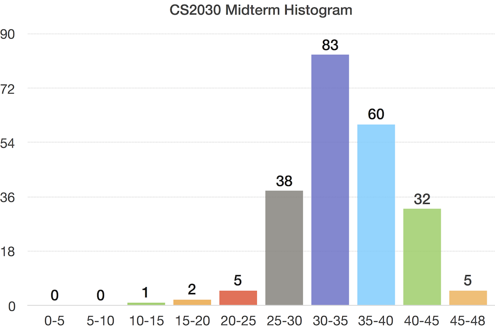

# Midterm

## Questions and Solutions

Here is [a copy of the question paper with annotated solutions](https://www.comp.nus.edu.sg/~cs2030/1718-s1/midterm-w-solution.pdf)

## Mark Distribution

## Midterm Info Sheet

### Important Information
- Date: October 2, 2017
- Time: 1000 - 1120
- Venue: LT19

Please arrive at least 5 minutes earlier and wait outside LT19 besides the canteen.

### Scope
- Everything taught during Week 1 - Week 6
- Lab 1 - Lab 3

### Open Book
This is an open book midterm.  You can bring in books and notes.  They can be printed or hand written.  No digital materials (laptop, tablet, etc.).  Any Java API needed will be provided to you.

### Office Hours

Kenneth and I will be holding special office hours before the midterm:

Who | Date | Time | Venue |
----|------|------|-------|
Wei Tsang | Sep 28 (Thu) | 2-5pm | AS6 #05-14 |
Kenneth | Sep 29 (Fri) | 2-5pm | DR6 (COM2 #02-12) |
